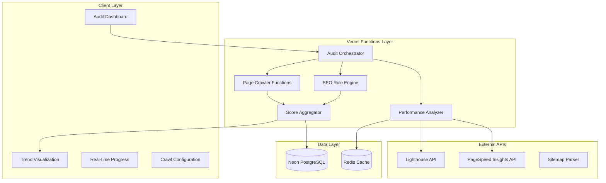

# SEO Site Audit System Design Document

## Overview

The SEO Site Audit System is a comprehensive website analysis platform that automatically crawls websites, detects 140+ types of SEO issues, and provides actionable recommendations with trend analysis. The system is designed to handle 10-20 page sites initially, with configurable Desktop/Mobile crawl modes, sitemap integration for orphan page detection, and dual performance analysis using both Lighthouse and PageSpeed Insights APIs.

This system establishes the foundation for future cold email domain management features while providing immediate value through comprehensive SEO auditing capabilities similar to Semrush's Site Audit tool.

## Architecture

### High-Level Architecture



### Technology Stack

**Frontend Components**

- Next.js 15 App Router with React 19 for server-side rendering and client interactivity
- shadcn/ui component library with dark theme design system
- TanStack Query for real-time audit progress tracking and result caching
- Recharts/Chart.js for trend visualization and score progression graphs
- Tailwind CSS with responsive design for desktop and mobile interfaces

**Backend Services**

- Next.js 15 Server Actions for audit orchestration and data management
- Vercel Functions with microservice architecture to handle timeout constraints (10s Hobby, 60s Pro with waitUntil support)
- Playwright (primary) with Puppeteer fallback for JavaScript-enabled website crawling with Desktop/Mobile user agents
- Custom weighted rule engine for 140+ SEO issue detection types
- Drizzle ORM for type-safe database operations and audit result management

**Infrastructure**

- Vercel Pro Plan deployment for 60-second function timeouts and enhanced reliability
- Neon PostgreSQL for audit result storage, historical tracking, and trend analysis
- Redis caching for crawl result optimization and performance enhancement
- Background job processing system for large site audits with progress tracking

## Components and Interfaces

### Core Components

#### 1. Audit Orchestrator

```typescript
interface AuditOrchestrator {
  initiateAudit(config: AuditConfig): Promise<AuditSession>;
  validateUrl(url: string): Promise<UrlValidationResult>;
  discoverSitemap(domain: string): Promise<SitemapData | null>;
  discoverAllSitemaps(domain: string): Promise<SitemapData[]>; // Support for sitemap index files
  queueAnalysisTasks(session: AuditSession, pages: Page[]): Promise<void>;
}

interface AuditConfig {
  url: string;
  crawlMode: 'desktop' | 'mobile';
  maxPages: number; // Limited to 1000
  includePerformance: boolean;
  customRules?: SEORuleConfig[];
}

interface AuditSession {
  id: string;
  userId: string;
  url: string;
  config: AuditConfig;
  status: 'initializing' | 'crawling' | 'analyzing' | 'completed' | 'failed';
  progress: number;
  startedAt: Date;
  estimatedCompletion?: Date;
}
```

#### 2. Page Crawler Service

```typescript
interface PageCrawler {
  crawlPage(url: string, config: CrawlConfig): Promise<CrawlResult>;
  analyzeTechnicalSEO(
    html: string,
    metadata: PageMetadata
  ): Promise<SEOIssue[]>;
  detectOrphanPages(
    crawledPages: Page[],
    sitemapUrls: string[]
  ): Promise<OrphanPage[]>;
}

interface CrawlConfig {
  userAgent: string;
  viewport: { width: number; height: number };
  timeout: number; // Max 8 seconds to stay within Vercel limits
  followRedirects: boolean;
}

interface CrawlResult {
  url: string;
  statusCode: number;
  html: string;
  metadata: PageMetadata;
  loadTime: number;
  resources: Resource[];
  issues: SEOIssue[];
}

interface PageMetadata {
  title?: string;
  description?: string;
  keywords?: string;
  canonicalUrl?: string;
  robots?: string;
  structuredData: any[];
  openGraph: OpenGraphData;
  socialTags: SocialTag[];
}
```

#### 3. Performance Analyzer

```typescript
interface PerformanceAnalyzer {
  analyzeLighthouse(url: string): Promise<LighthouseResult>;
  analyzePageSpeed(url: string): Promise<PageSpeedResult>;
  calculateCoreWebVitals(
    lighthouseData: any,
    pageSpeedData: any
  ): Promise<CoreWebVitals>;
}

interface LighthouseResult {
  performance: number;
  accessibility: number;
  bestPractices: number;
  seo: number;
  coreWebVitals: {
    lcp: number;
    inp: number; // Replaced FID as of March 2024
    cls: number;
  };
  recommendations: LighthouseRecommendation[];
}

interface PageSpeedResult {
  fieldData?: {
    lcp: MetricData;
    inp: MetricData;
    cls: MetricData;
  };
  labData: {
    lcp: number;
    tbt: number;
    cls: number;
  };
  overallCategory: 'FAST' | 'AVERAGE' | 'SLOW';
}

interface CoreWebVitals {
  lcp: { value: number; rating: 'GOOD' | 'NEEDS_IMPROVEMENT' | 'POOR' };
  inp: { value: number; rating: 'GOOD' | 'NEEDS_IMPROVEMENT' | 'POOR' }; // Replaced FID as of March 2024
  cls: { value: number; rating: 'GOOD' | 'NEEDS_IMPROVEMENT' | 'POOR' };
  source: 'field' | 'lab' | 'combined';
}
```

#### 4. SEO Rule Engine

```typescript
interface SEORuleEngine {
  analyzeIssues(
    crawlResults: CrawlResult[],
    config: SEORuleConfig
  ): Promise<SEOAnalysisResult>;
  validateStructuredData(structuredData: any[]): Promise<StructuredDataIssue[]>;
  checkRobotsTxt(domain: string): Promise<RobotsTxtAnalysis>;
  validateLLMSTxt(domain: string): Promise<LLMSTxtAnalysis>;
  analyzeEEATSignals(html: string, metadata: PageMetadata): Promise<EEATIssue[]>; // E-E-A-T analysis for AI-era SEO
}

interface SEOAnalysisResult {
  technicalIssues: SEOIssue[];
  contentIssues: SEOIssue[];
  performanceIssues: SEOIssue[];
  securityIssues: SEOIssue[];
  overallScore: number;
  categoryScores: {
    technical: number; // 45% weight
    performance: number; // 25% weight
    content: number; // 20% weight
    security: number; // 10% weight
  };
}

interface SEOIssue {
  id: string;
  type: 'error' | 'warning' | 'notice';
  category: 'technical' | 'content' | 'performance' | 'security';
  title: string;
  description: string;
  pages: string[];
  impact: 'high' | 'medium' | 'low';
  fixRecommendation: string;
  exampleImplementation?: string;
  learnMoreUrl?: string;
}
```

#### 5. Health Score Calculator

```typescript
interface HealthScoreCalculator {
  calculateOverallScore(
    analysisResult: SEOAnalysisResult
  ): Promise<HealthScore>;
  calculateTrendData(
    currentScore: HealthScore,
    historicalScores: HealthScore[]
  ): Promise<TrendData>;
  generateScoreBreakdown(issues: SEOIssue[]): Promise<ScoreBreakdown>;
}

interface HealthScore {
  overall: number; // 0-100
  categories: {
    technical: number; // 45% weight
    performance: number; // 25% weight
    content: number; // 20% weight
    security: number; // 10% weight
  };
  issueCount: {
    errors: number;
    warnings: number;
    notices: number;
  };
  calculatedAt: Date;
}

interface TrendData {
  scoreHistory: { date: Date; score: number }[];
  categoryTrends: {
    technical: { date: Date; score: number }[];
    performance: { date: Date; score: number }[];
    content: { date: Date; score: number }[];
    security: { date: Date; score: number }[];
  };
  improvementRate: number;
  lastImprovement?: Date;
}
```

### API Endpoints

#### Audit Management Endpoints

```typescript
// POST /api/audit/start
interface StartAuditRequest {
  url: string;
  config: AuditConfig;
}

interface StartAuditResponse {
  sessionId: string;
  estimatedDuration: number;
  status: 'started';
}

// GET /api/audit/[sessionId]/progress
interface AuditProgressResponse {
  sessionId: string;
  progress: number;
  currentStep: string;
  pagesAnalyzed: number;
  totalPages: number;
  issues: number;
  estimatedCompletion: Date;
}

// GET /api/audit/[sessionId]/results
interface AuditResultsResponse {
  sessionId: string;
  url: string;
  completedAt: Date;
  healthScore: HealthScore;
  issues: SEOIssue[];
  orphanPages: OrphanPage[];
  performanceData: CoreWebVitals;
  recommendedActions: string[];
}

// GET /api/audit/history
interface AuditHistoryResponse {
  audits: {
    sessionId: string;
    url: string;
    completedAt: Date;
    healthScore: number;
    issueCount: number;
  }[];
  trendData: TrendData;
}
```

### Data Models

#### Database Schema

```sql
-- Audit Sessions
CREATE TABLE audit_sessions (
  id UUID PRIMARY KEY DEFAULT gen_random_uuid(),
  user_id UUID NOT NULL REFERENCES neon_auth.users_sync(id) ON DELETE CASCADE,
  url VARCHAR(2048) NOT NULL,
  crawl_mode VARCHAR(20) NOT NULL CHECK (crawl_mode IN ('desktop', 'mobile')),
  status VARCHAR(20) NOT NULL DEFAULT 'initializing',
  progress INTEGER DEFAULT 0,
  max_pages INTEGER DEFAULT 1000,
  pages_crawled INTEGER DEFAULT 0,
  health_score JSONB,
  config JSONB NOT NULL,
  started_at TIMESTAMPTZ DEFAULT CURRENT_TIMESTAMP,
  completed_at TIMESTAMPTZ,
  estimated_completion TIMESTAMPTZ,
  created_at TIMESTAMPTZ DEFAULT CURRENT_TIMESTAMP,
  updated_at TIMESTAMPTZ DEFAULT CURRENT_TIMESTAMP
);

-- SEO Issues
CREATE TABLE seo_issues (
  id UUID PRIMARY KEY DEFAULT gen_random_uuid(),
  session_id UUID NOT NULL REFERENCES audit_sessions(id) ON DELETE CASCADE,
  issue_type VARCHAR(20) NOT NULL CHECK (issue_type IN ('error', 'warning', 'notice')),
  category VARCHAR(20) NOT NULL CHECK (category IN ('technical', 'content', 'performance', 'security')),
  title VARCHAR(255) NOT NULL,
  description TEXT NOT NULL,
  affected_pages TEXT[] NOT NULL,
  impact VARCHAR(10) NOT NULL CHECK (impact IN ('high', 'medium', 'low')),
  fix_recommendation TEXT NOT NULL,
  example_implementation TEXT,
  learn_more_url VARCHAR(2048),
  created_at TIMESTAMPTZ DEFAULT CURRENT_TIMESTAMP
);

-- Crawled Pages
CREATE TABLE crawled_pages (
  id UUID PRIMARY KEY DEFAULT gen_random_uuid(),
  session_id UUID NOT NULL REFERENCES audit_sessions(id) ON DELETE CASCADE,
  url VARCHAR(2048) NOT NULL,
  status_code INTEGER NOT NULL,
  load_time INTEGER NOT NULL,
  title VARCHAR(255),
  description TEXT,
  canonical_url VARCHAR(2048),
  meta_robots VARCHAR(100),
  structured_data JSONB,
  is_orphan BOOLEAN DEFAULT FALSE,
  discovered_via VARCHAR(50) NOT NULL DEFAULT 'crawl',
  created_at TIMESTAMPTZ DEFAULT CURRENT_TIMESTAMP
);

-- Performance Data
CREATE TABLE performance_data (
  id UUID PRIMARY KEY DEFAULT gen_random_uuid(),
  session_id UUID NOT NULL REFERENCES audit_sessions(id) ON DELETE CASCADE,
  url VARCHAR(2048) NOT NULL,
  lighthouse_score JSONB,
  pagespeed_data JSONB,
  core_web_vitals JSONB NOT NULL,
  recommendations JSONB,
  data_source VARCHAR(20) NOT NULL CHECK (data_source IN ('field', 'lab', 'combined')),
  created_at TIMESTAMPTZ DEFAULT CURRENT_TIMESTAMP
);

-- Audit History for Trends
CREATE TABLE audit_history (
  id UUID PRIMARY KEY DEFAULT gen_random_uuid(),
  user_id UUID NOT NULL REFERENCES neon_auth.users_sync(id) ON DELETE CASCADE,
  url VARCHAR(2048) NOT NULL,
  session_id UUID NOT NULL REFERENCES audit_sessions(id),
  health_score JSONB NOT NULL,
  issue_counts JSONB NOT NULL,
  crawl_mode VARCHAR(20) NOT NULL,
  completed_at TIMESTAMPTZ NOT NULL,
  created_at TIMESTAMPTZ DEFAULT CURRENT_TIMESTAMP
);

-- Indexes for performance
CREATE INDEX idx_audit_sessions_user_id ON audit_sessions(user_id);
CREATE INDEX idx_audit_sessions_url ON audit_sessions(url);
CREATE INDEX idx_seo_issues_session_id ON seo_issues(session_id);
CREATE INDEX idx_seo_issues_category ON seo_issues(category);
CREATE INDEX idx_crawled_pages_session_id ON crawled_pages(session_id);
CREATE INDEX idx_performance_data_session_id ON performance_data(session_id);
CREATE INDEX idx_audit_history_user_url ON audit_history(user_id, url);
```

#### Client-Side Models

```typescript
interface AuditDashboardState {
  currentSession?: AuditSession;
  progress: number;
  results?: AuditResults;
  trendData?: TrendData;
  isLoading: boolean;
  error?: string;

  // Actions
  startAudit: (config: AuditConfig) => Promise<void>;
  fetchProgress: (sessionId: string) => Promise<void>;
  fetchResults: (sessionId: string) => Promise<void>;
  fetchTrendData: (url: string) => Promise<void>;
}

interface AuditResults {
  sessionId: string;
  url: string;
  healthScore: HealthScore;
  issues: SEOIssue[];
  orphanPages: OrphanPage[];
  performanceData: CoreWebVitals;
  completedAt: Date;
  recommendations: RecommendedAction[];
}

interface RecommendedAction {
  priority: 'critical' | 'important' | 'minor';
  category: string;
  title: string;
  description: string;
  estimatedImpact: string;
  implementationTime: string;
  resources: string[];
}
```

## Error Handling

### Error Categories and Handling Strategy

#### 1. Vercel Function Timeout Errors

```typescript
class TimeoutErrorHandler {
  static handle(error: TimeoutError): ErrorResponse {
    switch (error.type) {
      case 'FUNCTION_TIMEOUT':
        return {
          message:
            'Analysis taking longer than expected. Please try with fewer pages or upgrade to Pro plan.',
          action: 'reduce_scope',
          fallback: 'partial_results',
          retryable: true,
          retryDelay: 30000,
        };
      case 'EXTERNAL_API_TIMEOUT':
        return {
          message:
            'External service temporarily unavailable. Retrying with cached data.',
          action: 'use_cached_data',
          fallback: 'skip_external_analysis',
          retryable: true,
        };
    }
  }
}
```

#### 2. Crawling and Access Errors

```typescript
class CrawlErrorHandler {
  static handle(error: CrawlError): ErrorResponse {
    switch (error.type) {
      case 'ACCESS_DENIED':
        return {
          message:
            'Website blocks automated crawling. Analysis limited to public pages.',
          action: 'continue_with_restrictions',
          fallback: 'sitemap_only_analysis',
        };
      case 'RATE_LIMITED':
        return {
          message: 'Crawling rate limited. Implementing intelligent delays.',
          action: 'reduce_crawl_speed',
          fallback: 'priority_pages_only',
        };
      case 'SSL_ERROR':
        return {
          message:
            'SSL certificate issues detected. This affects SEO rankings.',
          action: 'flag_as_issue',
          fallback: 'skip_secure_analysis',
        };
    }
  }
}
```

#### 3. API Integration Errors

```typescript
class APIErrorHandler {
  static handle(error: APIError): ErrorResponse {
    switch (error.service) {
      case 'LIGHTHOUSE':
        return {
          message:
            'Lighthouse analysis temporarily unavailable. Using cached performance data.',
          action: 'use_pagespeed_only',
          fallback: 'skip_performance_analysis',
        };
      case 'PAGESPEED_INSIGHTS':
        return {
          message:
            'PageSpeed Insights data unavailable. Using Lighthouse lab data only.',
          action: 'use_lighthouse_only',
          fallback: 'synthetic_performance_only',
        };
    }
  }
}
```

### Global Error Handling

```typescript
class GlobalErrorBoundary {
  static async handleAuditError(
    error: Error,
    sessionId: string
  ): Promise<void> {
    // Log error with context
    console.error(`Audit Error [${sessionId}]:`, error);

    // Update session status
    await updateAuditSession(sessionId, {
      status: 'failed',
      error: error.message,
      completedAt: new Date(),
    });

    // Notify user through real-time updates
    await notifyAuditProgress(sessionId, {
      status: 'failed',
      error: this.getUserFriendlyMessage(error),
    });

    // Attempt graceful degradation
    if (error.recoverable) {
      await this.attemptRecovery(sessionId, error);
    }
  }

  private static getUserFriendlyMessage(error: Error): string {
    // Convert technical errors to user-friendly messages
    const errorMessages = {
      'Function timeout':
        'Analysis is taking longer than expected. Consider reducing the number of pages to analyze.',
      'Network error':
        'Unable to access the website. Please check the URL and try again.',
      'Rate limited':
        'The website is limiting our analysis speed. This may take a bit longer.',
    };

    return (
      errorMessages[error.type] ||
      'An unexpected error occurred. Our team has been notified.'
    );
  }
}
```

## Testing Strategy

### Testing Approach

#### 1. Unit Tests (60%)

```typescript
describe('SEO Rule Engine', () => {
  describe('analyzeMetaTags', () => {
    it('should detect missing meta descriptions', async () => {
      const html = '<html><head><title>Test</title></head></html>';
      const issues = await seoRuleEngine.analyzeMetaTags(html);

      expect(issues).toContainEqual({
        type: 'warning',
        category: 'content',
        title: 'Missing Meta Description',
        impact: 'medium',
      });
    });

    it('should validate meta description length', async () => {
      const longDescription = 'x'.repeat(200);
      const html = `<meta name="description" content="${longDescription}">`;
      const issues = await seoRuleEngine.analyzeMetaTags(html);

      expect(issues).toContainEqual(
        expect.objectContaining({
          title: 'Meta Description Too Long',
        })
      );
    });
  });
});

describe('Health Score Calculator', () => {
  it('should weight technical issues at 45%', async () => {
    const analysisResult = {
      technicalIssues: [{ impact: 'high' }],
      contentIssues: [],
      performanceIssues: [],
      securityIssues: [],
    };

    const score = await healthScoreCalculator.calculateOverallScore(
      analysisResult
    );
    expect(score.categories.technical).toBeLessThan(100);
    expect(score.overall).toBeLessThan(55); // 45% of 100
  });
});
```

#### 2. Integration Tests (25%)

```typescript
describe('Audit Workflow Integration', () => {
  it('should complete full audit workflow for small site', async () => {
    const config = {
      url: 'https://example.com',
      crawlMode: 'desktop',
      maxPages: 5,
    };

    const session = await auditOrchestrator.initiateAudit(config);
    expect(session.status).toBe('initializing');

    // Wait for completion (with timeout)
    const result = await waitForAuditCompletion(session.id, 30000);
    expect(result.status).toBe('completed');
    expect(result.healthScore).toBeDefined();
    expect(result.issues.length).toBeGreaterThan(0);
  });

  it('should handle Vercel function timeout gracefully', async () => {
    // Mock a slow response that would exceed 10 seconds
    jest
      .spyOn(pageCrawler, 'crawlPage')
      .mockImplementation(
        () => new Promise((resolve) => setTimeout(resolve, 12000))
      );

    const config = { url: 'https://slow-site.com', maxPages: 20 };
    const session = await auditOrchestrator.initiateAudit(config);

    // Should implement timeout handling
    const result = await waitForAuditCompletion(session.id, 15000);
    expect(result.status).toBe('completed'); // Should complete with partial results
  });
});
```

#### 3. E2E Tests (15%)

```typescript
describe('SEO Audit Dashboard E2E', () => {
  it('should complete full user audit workflow', async () => {
    // Navigate to dashboard
    await page.goto('/dashboard');

    // Start new audit
    await page.fill('[data-testid=url-input]', 'https://test-site.com');
    await page.selectOption('[data-testid=crawl-mode]', 'desktop');
    await page.click('[data-testid=start-audit]');

    // Wait for progress updates
    await expect(page.locator('[data-testid=progress-bar]')).toBeVisible();

    // Wait for completion
    await page.waitForSelector('[data-testid=audit-results]', {
      timeout: 60000,
    });

    // Verify results display
    expect(
      await page.locator('[data-testid=health-score]').textContent()
    ).toMatch(/\d+/);
    expect(
      await page.locator('[data-testid=issues-list] .issue-item').count()
    ).toBeGreaterThan(0);

    // Test trend visualization
    await page.click('[data-testid=trends-tab]');
    await expect(page.locator('[data-testid=trend-chart]')).toBeVisible();
  });
});
```

### Testing Tools and Configuration

**Unit Testing**

- Vitest for fast unit testing with TypeScript support
- MSW (Mock Service Worker) for API mocking
- Test databases with Docker containers for isolation

**Integration Testing**

- Playwright for browser automation and API testing
- Test Vercel functions locally with vercel dev
- Redis and PostgreSQL test containers

**E2E Testing**

- Playwright for cross-browser testing
- Visual regression testing with Percy or Chromatic
- Performance testing with Lighthouse CI

## Platform-Specific Considerations

### Vercel Deployment Optimizations

```typescript
interface VercelOptimization {
  functions: {
    'api/audit/orchestrator': {
      maxDuration: 60; // Pro plan limit
      memory: 1024; // MB for heavy operations
    };
    'api/audit/crawler': {
      maxDuration: 8;
      memory: 1024;
      // Use waitUntil for post-response tasks
      useWaitUntil: true;
    };
    'api/audit/performance': {
      maxDuration: 10;
      memory: 512;
      useWaitUntil: true;
    };
    'api/audit/analyzer': {
      maxDuration: 5;
      memory: 512;
    };
  };

  caching: {
    sitemaps: { ttl: 3600 }; // 1 hour
    performance: { ttl: 1800 }; // 30 minutes
    rules: { ttl: 86400 }; // 24 hours
  };

  backgroundProcessing: {
    queue: 'redis';
    concurrency: 3;
    retries: 2;
  };

  cronJobs: {
    weeklyReaudits: '0 2 * * 1'; // Monday 2 AM
    cleanupExpiredSessions: '0 1 * * *'; // Daily 1 AM
  };
}
```

### Desktop vs Mobile Crawl Modes

```typescript
interface CrawlModeConfig {
  desktop: {
    userAgent: 'Mozilla/5.0 (Windows NT 10.0; Win64; x64) AppleWebKit/537.36';
    viewport: { width: 1920; height: 1080 };
    device: undefined;
  };

  mobile: {
    userAgent: 'Mozilla/5.0 (iPhone; CPU iPhone OS 14_7_1 like Mac OS X) AppleWebKit/605.1.15';
    viewport: { width: 375; height: 667 };
    device: 'iPhone 12';
  };
}

class PlatformCrawler {
  static async crawlWithMode(
    url: string,
    mode: 'desktop' | 'mobile'
  ): Promise<CrawlResult> {
    const config = CrawlModeConfig[mode];

    // Use Playwright as primary, Puppeteer as fallback
    try {
      const { chromium } = await import('playwright');
      const browser = await chromium.launch({
        args: ['--no-sandbox', '--disable-setuid-sandbox'], // Vercel requirements
      });

      const context = await browser.newContext({
        userAgent: config.userAgent,
        viewport: config.viewport,
        ...(config.device && { ...chromium.devices[config.device] }),
      });

      const page = await context.newPage();
      // Implement crawling logic...

    } catch (playwrightError) {
      // Fallback to Puppeteer
      const puppeteer = await import('puppeteer');
      const browser = await puppeteer.launch({
        args: ['--no-sandbox', '--disable-setuid-sandbox'],
      });

      const page = await browser.newPage();
      await page.setUserAgent(config.userAgent);
      await page.setViewport(config.viewport);

      if (config.device) {
        await page.emulate(puppeteer.devices[config.device]);
      }
      // Implement crawling logic...
    }
  }
}
```

## Performance Considerations

### Performance Requirements

- Audit initiation: < 3 seconds response time
- Progress updates: < 1 second refresh rate
- Small sites (10-20 pages): Complete audit within 2 minutes
- Dashboard loading: < 1 second for cached results
- Trend visualizations: < 2 seconds to render

### Optimization Strategies

**Function-Level Optimizations**

```typescript
// Implement intelligent batching to stay within timeout limits
class BatchProcessor {
  static async processPagesInBatches(
    pages: string[],
    batchSize = 5
  ): Promise<CrawlResult[]> {
    const results: CrawlResult[] = [];
    const batches = chunk(pages, batchSize);

    for (const batch of batches) {
      const batchPromises = batch.map((url) =>
        Promise.race([
          this.crawlPage(url),
          this.timeoutPromise(8000), // Stay under 10s limit
        ])
      );

      const batchResults = await Promise.allSettled(batchPromises);
      results.push(
        ...batchResults
          .filter((r) => r.status === 'fulfilled')
          .map((r) => r.value)
      );
    }

    return results;
  }
}
```

**Caching Strategy**

```typescript
interface CachingStrategy {
  redis: {
    sitemaps: '1h';
    robotsTxt: '24h';
    performanceData: '30m';
    ruleResults: '1h';
  };

  database: {
    auditHistory: 'permanent';
    userPreferences: 'permanent';
    crawlResults: '30d';
  };

  browser: {
    dashboardData: '5m';
    trendCharts: '15m';
    issueDetails: '10m';
  };
}
```

**Database Optimization**

- Connection pooling for concurrent operations
- Indexed queries for trend analysis
- Partitioned tables for audit history
- Compressed JSON storage for large result sets

### Monitoring and Metrics

```typescript
interface PerformanceMetrics {
  auditDuration: Histogram;
  functionExecutionTime: Histogram;
  apiResponseTime: Histogram;
  errorRate: Counter;
  concurrentAudits: Gauge;
  cacheHitRate: Histogram;
  pageSpeedApiQuota: Gauge; // Monitor API quota usage
  lighthouseApiQuota: Gauge;
}

class PerformanceMonitor {
  static trackAuditPerformance(sessionId: string, metrics: AuditMetrics): void {
    // Track key metrics for optimization
    this.metrics.auditDuration.observe(metrics.totalDuration);
    this.metrics.functionExecutionTime.observe(metrics.averageFunctionTime);

    // Monitor API quota usage (PageSpeed: 25k/day, 240/min)
    this.metrics.pageSpeedApiQuota.set(metrics.pageSpeedRequestsToday);

    // Alert on performance degradation
    if (metrics.totalDuration > 180000) {
      // 3 minutes
      this.alertSlowAudit(sessionId, metrics);
    }

    // Alert on quota exhaustion
    if (metrics.pageSpeedRequestsToday > 23000) {
      // 92% of daily quota
      this.alertQuotaNearLimit('PageSpeed', metrics.pageSpeedRequestsToday);
    }
  }
}
```

## Security Considerations

### Security Requirements

- User authentication via Stack Auth integration
- Audit data isolation per user account
- Encrypted storage of sensitive crawl data
- Rate limiting on audit API endpoints
- Input validation and sanitization for all URLs

### Security Implementation

```typescript
class SecurityMiddleware {
  static validateAuditRequest(req: AuditRequest): ValidationResult {
    // URL validation and sanitization
    if (!this.isValidUrl(req.url)) {
      throw new SecurityError('Invalid URL format');
    }

    // Prevent crawling of internal/private networks
    if (this.isInternalNetwork(req.url)) {
      throw new SecurityError('Cannot audit internal network resources');
    }

    // Rate limiting per user
    if (!this.checkRateLimit(req.userId)) {
      throw new SecurityError('Rate limit exceeded');
    }

    return { valid: true };
  }

  static sanitizeCrawlData(crawlData: CrawlResult): CrawlResult {
    // Remove sensitive information from crawl results
    return {
      ...crawlData,
      html: this.sanitizeHtml(crawlData.html),
      headers: this.filterSensitiveHeaders(crawlData.headers),
    };
  }
}
```

**Data Protection**

- GDPR compliance for audit data storage
- User data deletion cascade on account removal
- Audit log retention policy (30 days)
- Encrypted storage for performance API keys

## Deployment and Infrastructure

### Deployment Strategy

```typescript
interface DeploymentConfig {
  vercel: {
    plan: 'pro'; // Required for 60s function timeout
    regions: ['iad1', 'sfo1']; // US East & West
    functions: {
      memory: '1024mb';
      maxDuration: 60;
    };
  };

  database: {
    provider: 'neon';
    tier: 'pro';
    region: 'us-east-1';
    connections: 100;
  };

  cache: {
    provider: 'upstash-redis';
    region: 'us-east-1';
    maxMemory: '256mb';
  };
}
```

**CI/CD Pipeline**

1. **Pre-deployment Testing**

   - Run full test suite (unit + integration)
   - Database migration validation
   - Performance benchmark testing

2. **Deployment Process**

   - Blue-green deployment via Vercel
   - Database migration execution
   - Cache warming for critical data

3. **Post-deployment Validation**
   - Smoke tests for audit functionality
   - Performance monitoring activation
   - Error rate monitoring

### Infrastructure Requirements

**Scaling Considerations**

```typescript
interface ScalingStrategy {
  concurrent_audits: 50; // Per region
  database_connections: 100;
  redis_connections: 200;
  function_concurrency: 10; // Per function type

  auto_scaling: {
    triggers: ['function_duration > 45s', 'error_rate > 5%'];
    actions: ['increase_function_memory', 'reduce_batch_size'];
  };
}
```

## Migration and Rollback

### Migration Strategy

- **Phase 1**: Deploy audit infrastructure with feature flags
- **Phase 2**: Migrate existing domain data (if any) to new schema
- **Phase 3**: Enable SEO audit features gradually
- **Phase 4**: Full feature activation with monitoring

### Rollback Plan

```typescript
interface RollbackProcedure {
  triggers: [
    'error_rate > 10%',
    'function_timeout > 50%',
    'user_complaints > threshold'
  ];

  automated_rollback: {
    revert_deployment: true;
    restore_database: true;
    clear_cache: true;
    notify_team: true;
  };

  manual_procedures: {
    data_recovery: 'restore_from_backup';
    user_notification: 'service_status_page';
    investigation: 'error_analysis_runbook';
  };
}
```

## Assumptions and Dependencies

### Technical Assumptions

- Target websites are publicly accessible (no authentication walls)
- Most sites have standard HTML structure and common CMS patterns
- Vercel Pro plan provides sufficient function timeout (60s) for small site audits
- External APIs (Lighthouse, PageSpeed Insights) maintain reasonable availability

### External Dependencies

- **Puppeteer/Playwright**: Maintained browser automation libraries
- **Lighthouse API**: Google's performance analysis service
- **PageSpeed Insights API**: Google's real-world performance data
- **Neon PostgreSQL**: Managed database service availability
- **Upstash Redis**: Managed caching service reliability

### Risk Mitigation

- **API Rate Limits**: Implement intelligent backoff and caching strategies
- **Function Timeouts**: Microservice architecture with graceful degradation
- **External Service Outages**: Fallback mechanisms and cached data usage
- **Database Performance**: Connection pooling and query optimization
- **Security Threats**: Input validation, rate limiting, and audit logging

---

**Requirements Traceability**: This design addresses all requirements from requirements.md including:

- Configurable Desktop/Mobile crawl modes (R1.1, R1.4)
- 1000-page limit with intelligent prioritization (R1.3)
- Sitemap integration and orphan page detection (R2.1-R2.4)
- 140+ SEO issue detection types (R3.1-R3.2)
- Weighted health scoring (Technical 45%, Performance 25%, Content 20%, Security 10%) (R4.1-R4.2)
- Dual Performance API integration (Lighthouse + PageSpeed Insights) (R5.1-R5.5)
- Trend visualization and historical tracking (R4.3-R4.4)
- Real-time progress tracking (R6.1-R6.4)
- Vercel deployment optimization for 10-20 page sites

**Review Status**: Draft

**Last Updated**: 2025-09-25

**Reviewers**: Technical Lead, Product Owner, DevOps Engineer
