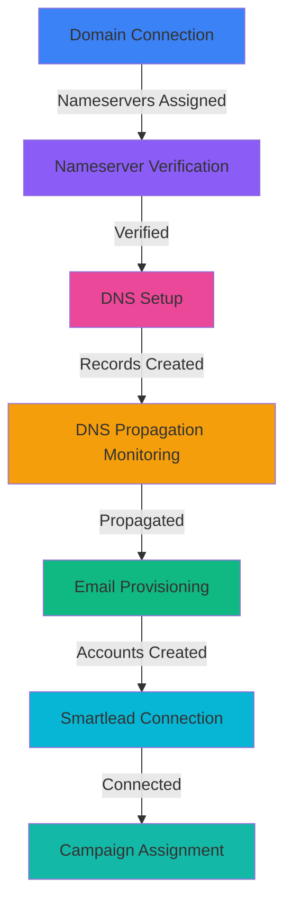

# Backend API Reference - Email Infrastructure Setup Tool

**Version:** 1.0
**Last Updated:** 2025-10-07
**Purpose:** Comprehensive API documentation for Phase 7 wizard integration

---

## Table of Contents

1. [Overview & Architecture](#overview--architecture)
2. [Integration Workflow](#integration-workflow)
3. [Domain Management APIs](#domain-management-apis)
4. [DNS Configuration APIs](#dns-configuration-apis)
5. [DNS Polling & Status APIs](#dns-polling--status-apis)
6. [Email Provisioning APIs](#email-provisioning-apis)
7. [Smartlead Integration APIs](#smartlead-integration-apis)
8. [Wizard Step Integration Guide](#wizard-step-integration-guide)
9. [TanStack Query Integration](#tanstack-query-integration)
10. [Error Handling Patterns](#error-handling-patterns)
11. [Type Reference](#type-reference)

---

## Overview & Architecture

### System Architecture

```
┌─────────────────────────────────────────────────────────────────┐
│                    Phase 7: Frontend Wizard UI                   │
│  (TanStack Query + Server Actions + shadcn/ui Components)       │
└────────────┬────────────────────────────────────────────────────┘
             │ Server Actions
             ├──────────────────────────────────────────────────┐
             │                                                  │
┌────────────▼────────────┐  ┌───────────────┐  ┌──────────────▼──────┐
│  Domain Orchestrator    │  │  DNS Manager  │  │  Email Provisioner  │
│  (Phase 2)              │  │  (Phase 3)    │  │  (Phase 5)          │
└─────────────────────────┘  └───────────────┘  └─────────────────────┘
             │                       │                    │
             │                       │                    │
┌────────────▼───────────────────────▼────────────────────▼────────┐
│              DNS Polling & Status (Phase 4)                       │
│  - Real-time propagation monitoring (30-second intervals)        │
│  - Server Actions for status updates                             │
└───────────────────────────────────────────────────────────────────┘
             │
┌────────────▼────────────┐
│  Smartlead Integration  │
│  (Phase 6)              │
└─────────────────────────┘
```

### Authentication Pattern

**All Server Actions use Stack Auth for authentication:**

```typescript
import { stackServerApp } from '@/stack/server';

// In every Server Action:
const user = await stackServerApp.getUser();
if (!user) {
  return { success: false, error: 'Authentication required' };
}

// Use user.id for authorization checks
```

⚠️ **IMPORTANT**: `stackServerApp.getUser()` does NOT accept a userId parameter - it retrieves the currently authenticated user from the session.

### Data Flow Pattern

```
User Action (UI)
  → Server Action (authentication check)
    → Service Layer (business logic)
      → API Client / Database (external calls)
        → Database Update
          → Return to UI
```

---

## Integration Workflow

### Complete Setup Flow



### State Transitions

| Step | Initial State | Success State | Requires |
|------|--------------|---------------|----------|
| 1. Domain Connection | `pending` | `pending_nameservers` | User input |
| 2. Nameserver Verification | `pending_nameservers` | `verified` | DNS propagation |
| 3. DNS Setup | `verified` | `dns_configuring` | Cloudflare credentials |
| 4. DNS Monitoring | `dns_configuring` | `ready` | 30s polling |
| 5. Email Provisioning | `ready` | `provisioned` | Google Workspace |
| 6. Smartlead Connection | `provisioned` | `connected` | Smartlead API key |

---

## Domain Management APIs

### File Locations
- **Orchestrator**: `server/domain/domain-orchestrator.ts`
- **Verifier**: `server/domain/nameserver-verifier.ts`
- **Instructions**: `server/domain/nameserver-instructions.ts`
- **Types**: `lib/types/domain.ts`

---

### `connectDomain()`

**Purpose**: Initiates domain connection workflow with Cloudflare zone creation

**Location**: `server/domain/domain-orchestrator.ts`

**Signature**:
```typescript
async function connectDomain(
  input: DomainConnectionInput,
  userId: string,
  cloudflareCredentials: { apiToken: string; accountId: string }
): Promise<DomainConnectionResult>
```

**Parameters**:
- `input.domain` (string): Domain to connect (e.g., "example.com")
- `input.provider` (DomainProvider, optional): Registrar type (godaddy, namecheap, cloudflare, other)
- `input.notes` (string, optional): User notes for domain
- `userId` (string): Authenticated user ID
- `cloudflareCredentials.apiToken` (string): User's Cloudflare API token
- `cloudflareCredentials.accountId` (string): User's Cloudflare account ID

**Returns**:
```typescript
interface DomainConnectionResult {
  success: boolean;
  domain?: Domain;  // Database record
  nameserverInstructions?: NameserverInstructions;
  validationErrors?: string[];
  error?: string;
}
```

**Workflow**:
1. Validates domain format and sanitizes input
2. Checks for duplicate domains (per user)
3. Creates Cloudflare zone via API
4. Stores domain record in database with `pending_nameservers` status
5. Generates registrar-specific nameserver instructions
6. Returns domain record + instructions for UI display

**Error Handling**:
```typescript
// Validation errors
if (!validation.isValid) {
  return { success: false, validationErrors: validation.errors };
}

// Cloudflare API errors
catch (error) {
  return {
    success: false,
    error: `Failed to create Cloudflare zone: ${error.message}`
  };
}

// Duplicate domain
if (error.message.includes('unique')) {
  return { success: false, error: 'This domain is already connected' };
}
```

**Usage Example** (in Server Action):
```typescript
'use server';

import { stackServerApp } from '@/stack/server';
import { connectDomain } from '@/server/domain/domain-orchestrator';

export async function connectDomainAction(input: DomainConnectionInput) {
  // 1. Authenticate user
  const user = await stackServerApp.getUser();
  if (!user) {
    return { success: false, error: 'Authentication required' };
  }

  // 2. Get user's Cloudflare credentials from metadata
  const cloudflareToken = user.serverMetadata?.cloudflare.apiToken;
  const cloudflareAccountId = user.serverMetadata?.cloudflare.accountId;

  if (!cloudflareToken || !cloudflareAccountId) {
    return {
      success: false,
      error: 'Cloudflare credentials not configured'
    };
  }

  // 3. Connect domain
  const result = await connectDomain(
    input,
    user.id,
    { apiToken: cloudflareToken, accountId: cloudflareAccountId }
  );

  return result;
}
```

**UI Integration**:
```typescript
// In React component (with TanStack Query)
import { useMutation } from '@tanstack/react-query';
import { connectDomainAction } from '@/server/domain/domain.actions';

function DomainConnectionForm() {
  const mutation = useMutation({
    mutationFn: connectDomainAction,
    onSuccess: (data) => {
      if (data.success) {
        // Show nameserver instructions
        showNameserverInstructions(data.nameserverInstructions);
      }
    }
  });

  const handleSubmit = (formData) => {
    mutation.mutate({
      domain: formData.domain,
      provider: formData.provider,
    });
  };

  return (
    <form onSubmit={handleSubmit}>
      {/* Form fields */}
      {mutation.data?.nameserverInstructions && (
        <NameserverInstructions
          data={mutation.data.nameserverInstructions}
        />
      )}
    </form>
  );
}
```

---

### `verifyDomainNameservers()`

**Purpose**: Verifies nameservers point to Cloudflare and updates domain status

**Location**: `server/domain/nameserver-verifier.ts`

**Signature**:
```typescript
async function verifyDomainNameservers(
  domainId: string,
  userId: string
): Promise<NameserverVerificationResult>
```

**Parameters**:
- `domainId` (string): UUID of domain to verify
- `userId` (string): User ID for authorization

**Returns**:
```typescript
interface NameserverVerificationResult {
  success: boolean;
  isVerified: boolean;
  currentNameservers: string[];
  expectedNameservers: readonly string[]; // Cloudflare nameservers
  message: string;
  domain?: Domain;
  error?: string;
}
```

**Workflow**:
1. Fetches domain from database (with auth check)
2. Queries current nameservers via DNS lookup
3. Checks if nameservers match Cloudflare pattern (*.ns.cloudflare.com)
4. Updates domain status to `verified` if match found
5. Returns verification result

**Verification Logic**:
```typescript
// DNS query
const nsQuery = await queryNameservers('example.com');
// Returns: ['ns1.cloudflaressl.com', 'ns2.cloudflaressl.com']

// Check if Cloudflare
const isCloudflare = areNameserversCloudflare(nsQuery.nameservers);
// Returns: true if any nameserver ends with '.ns.cloudflare.com'

// If verified, update domain
if (isCloudflare) {
  await updateDomain({ verificationStatus: 'verified' });
}
```

**Error Handling**:
```typescript
// Domain not found
if (!domainRecord) {
  return {
    success: false,
    isVerified: false,
    error: 'Domain not found or you do not have permission to access it',
  };
}

// DNS query failed
if (!nsQuery.success) {
  return {
    success: true, // Request succeeded but verification failed
    isVerified: false,
    message: 'Failed to query nameservers',
  };
}

// Still using old nameservers
if (!isCloudflare) {
  return {
    success: true,
    isVerified: false,
    message: `Still detecting old nameservers. DNS changes can take up to 48 hours.`,
  };
}
```

**Usage Example** (Polling Pattern):
```typescript
'use server';

export async function verifyNameserversAction(domainId: string) {
  const user = await stackServerApp.getUser();
  if (!user) {
    return { success: false, error: 'Authentication required' };
  }

  const result = await verifyDomainNameservers(domainId, user.id);
  return result;
}
```

**UI Integration** (with TanStack Query Polling):
```typescript
import { useQuery } from '@tanstack/react-query';

function NameserverVerification({ domainId }: { domainId: string }) {
  const { data, isLoading } = useQuery({
    queryKey: ['nameserver-verification', domainId],
    queryFn: () => verifyNameserversAction(domainId),
    refetchInterval: (query) => {
      // Poll every 30 seconds if not verified
      const isVerified = query.state.data?.isVerified;
      return isVerified ? false : 30000; // 30 seconds
    },
    refetchOnWindowFocus: true,
  });

  if (isLoading) return <Spinner />;

  return (
    <div>
      {data?.isVerified ? (
        <SuccessMessage>Nameservers verified!</SuccessMessage>
      ) : (
        <PendingMessage>
          {data?.message}
          <br />
          Current: {data?.currentNameservers.join(', ')}
          <br />
          Expected: {data?.expectedNameservers.join(', ')}
        </PendingMessage>
      )}
    </div>
  );
}
```

---

### `generateNameserverInstructions()`

**Purpose**: Generates registrar-specific nameserver update instructions

**Location**: `server/domain/nameserver-instructions.ts`

**Signature**:
```typescript
function generateNameserverInstructions(
  provider: DomainProvider,
  nameservers: string[]
): NameserverInstructions
```

**Parameters**:
- `provider`: Registrar type (godaddy, namecheap, cloudflare, google-domains, name.com, hover, other)
- `nameservers`: Cloudflare-assigned nameservers (e.g., ['ns1.cloudflaressl.com', 'ns2.cloudflaressl.com'])

**Returns**:
```typescript
interface NameserverInstructions {
  provider: DomainProvider;
  providerName: string;  // Human-readable name
  nameservers: string[];
  instructions: string[];  // Step-by-step guide
  documentationUrl?: string;
  estimatedPropagationTime: string;
}
```

**Supported Providers**:

| Provider | Propagation Time | Documentation URL |
|----------|-----------------|-------------------|
| GoDaddy | 15-30 minutes | [Link](https://www.godaddy.com/help/change-nameservers-for-my-domains-664) |
| Namecheap | 30 mins - 2 hours | [Link](https://www.namecheap.com/support/knowledgebase/article.aspx/767/10/) |
| Cloudflare | Immediate | [Link](https://developers.cloudflare.com/dns/) |
| Google Domains | 24-48 hours | [Link](https://support.google.com/domains/answer/3290309) |
| Name.com | 1-2 hours | [Link](https://www.name.com/support/articles/205934547) |
| Hover | 2-4 hours | [Link](https://help.hover.com/hc/en-us/) |
| Other | 1-48 hours | [Link](https://developers.cloudflare.com/dns/zone-setups/full-setup/setup/) |

**Example Output** (GoDaddy):
```typescript
{
  provider: 'godaddy',
  providerName: 'GoDaddy',
  nameservers: ['ns1.cloudflaressl.com', 'ns2.cloudflaressl.com'],
  instructions: [
    'Log in to your GoDaddy account',
    'Navigate to "My Products" > "Domains"',
    'Click on the domain you want to connect',
    'Scroll down to "Additional Settings" section',
    'Click "Manage DNS"',
    'Click "Change Nameservers"',
    'Select "I\'ll use my own nameservers"',
    'Enter the Cloudflare nameservers shown below',
    'Click "Save" and wait for propagation (usually 15-30 minutes)',
  ],
  documentationUrl: 'https://www.godaddy.com/help/change-nameservers-for-my-domains-664',
  estimatedPropagationTime: '15-30 minutes',
}
```

**Usage Example**:
```typescript
// In domain-orchestrator.ts
const instructions = generateNameserverInstructions(
  'godaddy',
  ['ns1.cloudflaressl.com', 'ns2.cloudflaressl.com']
);

return {
  success: true,
  domain: newDomain,
  nameserverInstructions: instructions,
};
```

**UI Integration**:
```typescript
function NameserverInstructions({ data }: { data: NameserverInstructions }) {
  return (
    <Card>
      <CardHeader>
        <h3>Update Nameservers at {data.providerName}</h3>
        <p>Estimated time: {data.estimatedPropagationTime}</p>
      </CardHeader>
      <CardContent>
        <ol>
          {data.instructions.map((step, i) => (
            <li key={i}>{step}</li>
          ))}
        </ol>

        <div className="mt-4">
          <strong>Nameservers to use:</strong>
          {data.nameservers.map((ns, i) => (
            <div key={i} className="font-mono">
              {ns}
              <Button onClick={() => copyToClipboard(ns)}>Copy</Button>
            </div>
          ))}
        </div>

        {data.documentationUrl && (
          <a href={data.documentationUrl} target="_blank">
            View official documentation →
          </a>
        )}
      </CardContent>
    </Card>
  );
}
```

---

### Batch Operations

#### `batchVerifyNameservers()`

**Purpose**: Verify multiple domains in parallel

**Signature**:
```typescript
async function batchVerifyNameservers(
  domainIds: string[],
  userId: string
): Promise<NameserverVerificationResult[]>
```

**Features**:
- Processes domains in batches of 5 to avoid overwhelming DNS servers
- Returns array of verification results matching input order
- Useful for dashboard "Refresh All" functionality

**Usage**:
```typescript
const results = await batchVerifyNameservers(
  ['domain-1-id', 'domain-2-id', 'domain-3-id'],
  userId
);

// results[0] = verification for domain-1
// results[1] = verification for domain-2
// results[2] = verification for domain-3
```

---

## DNS Configuration APIs

### File Locations
- **Orchestrator**: `server/dns/dns-manager.ts`
- **SPF**: `server/dns/spf-flattener.ts`
- **DKIM**: `server/dns/dkim-generator.ts`
- **DMARC**: `server/dns/dmarc-generator.ts`
- **MX**: `server/dns/mx-generator.ts`
- **Tracking**: `server/dns/tracking-domain-setup.ts`
- **Record Creator**: `server/dns/cloudflare-record-creator.ts`
- **Types**: `lib/types/dns.ts`

---

### `setupEmailDNS()`

**Purpose**: **Main orchestrator** - sets up complete email DNS infrastructure in one call

**Location**: `server/dns/dns-manager.ts`

**Signature**:
```typescript
async function setupEmailDNS(
  config: DNSSetupConfig
): Promise<DNSSetupResult>
```

**Parameters**:
```typescript
interface DNSSetupConfig {
  // Domain details
  domain: string;
  domainId: string;  // Database domain ID
  zoneId: string;    // Cloudflare zone ID
  apiToken: string;  // Cloudflare API token

  // Email platform
  emailPlatform: 'google-workspace' | 'microsoft-365' | 'custom';
  customMXRecords?: Array<{ priority: number; server: string }>;

  // SPF configuration
  spfIncludes?: string[];       // Additional SPF includes
  existingSPFRecord?: string;   // Existing SPF to flatten

  // DKIM configuration
  dkimSelector?: string;    // Default: 'google'
  dkimPublicKey?: string;   // If already generated

  // DMARC configuration
  dmarcPolicy?: 'none' | 'quarantine' | 'reject';  // Default: 'none'
  dmarcReportEmail?: string;
  dmarcForensicEmail?: string;

  // Tracking domain (optional)
  enableTracking?: boolean;
  trackingSubdomain?: string;  // e.g., 'emailtracking', 'track'
  trackingProvider?: 'smartlead' | 'instantly' | 'none';

  // Options
  skipDuplicates?: boolean;  // Default: true
}
```

**Returns**:
```typescript
interface DNSSetupResult {
  success: boolean;
  domain: string;
  recordsCreated: number;
  recordsFailed: number;
  recordsSkipped: number;

  // Individual results
  spf?: DNSRecordSetupResult;
  dkim?: DNSRecordSetupResult;
  dmarc?: DNSRecordSetupResult;
  mx?: DNSRecordSetupResult;
  tracking?: DNSRecordSetupResult;

  // Batch creation result
  batchResult: BatchDNSRecordResult;

  // Errors and warnings
  errors: string[];
  warnings: string[];
}
```

**Workflow**:
1. **SPF**: Generates flattened SPF record with Google Workspace includes
2. **DKIM**: Creates Google Workspace DKIM TXT record (2048-bit key)
3. **DMARC**: Generates DMARC record with specified policy
4. **MX**: Creates Google Workspace MX records
5. **Tracking** (optional): Generates tracking domain CNAME
6. **Batch Create**: Creates all records in Cloudflare via batch API
7. **Database**: Saves all records to database with propagation status

**Usage Example** (Server Action):
```typescript
'use server';

import { setupEmailDNS } from '@/server/dns/dns-manager';

export async function setupDNSAction(domainId: string) {
  const user = await stackServerApp.getUser();
  if (!user) {
    return { success: false, error: 'Authentication required' };
  }

  // Fetch domain record
  const domain = await getDomain(domainId, user.id);
  if (!domain) {
    return { success: false, error: 'Domain not found' };
  }

  // Get Cloudflare credentials
  const apiToken = user.serverMetadata?.cloudflare.apiToken;
  if (!apiToken) {
    return { success: false, error: 'Cloudflare credentials not found' };
  }

  // Setup DNS
  const result = await setupEmailDNS({
    domain: domain.domain,
    domainId: domain.id,
    zoneId: domain.cloudflareZoneId!,
    apiToken,
    emailPlatform: 'google-workspace',
    dmarcPolicy: 'none',
    dmarcReportEmail: `dmarc@${domain.domain}`,
    enableTracking: true,
    trackingSubdomain: 'emailtracking',
    trackingProvider: 'smartlead',
    skipDuplicates: true,
  });

  return result;
}
```

**UI Integration**:
```typescript
import { useMutation } from '@tanstack/react-query';

function DNSSetupStep({ domainId }: { domainId: string }) {
  const mutation = useMutation({
    mutationFn: () => setupDNSAction(domainId),
    onSuccess: (result) => {
      if (result.success) {
        console.log(`Created ${result.recordsCreated} DNS records`);
        // Proceed to DNS monitoring step
      }
    }
  });

  return (
    <Button onClick={() => mutation.mutate()} disabled={mutation.isPending}>
      {mutation.isPending ? 'Setting up DNS...' : 'Configure DNS Records'}
    </Button>
  );
}
```

**Error Handling**:
```typescript
// Individual record failures don't stop entire process
if (result.success) {
  console.log('DNS setup completed');
  console.log(`Created: ${result.recordsCreated}`);
  console.log(`Failed: ${result.recordsFailed}`);
  console.log(`Skipped: ${result.recordsSkipped}`);

  if (result.errors.length > 0) {
    console.warn('Some records failed:', result.errors);
  }

  if (result.warnings.length > 0) {
    console.info('Warnings:', result.warnings);
  }
}
```

---

### DNS Record Generation Functions

#### `flattenSPFRecord()`

**Purpose**: Flattens SPF record to avoid 10 DNS lookup limit

**Location**: `server/dns/spf-flattener.ts`

**Signature**:
```typescript
async function flattenSPFRecord(params: {
  domain: string;
  originalSPF?: string;
  ipv6Support?: boolean;
}): Promise<SPFFlattenResult>
```

**Features**:
- Resolves all `include:` directives to IP addresses
- Supports IPv4 and IPv6
- Validates 512-character DNS TXT limit
- Caches resolved IPs to reduce DNS queries

**Example**:
```typescript
const result = await flattenSPFRecord({
  domain: 'example.com',
  originalSPF: 'v=spf1 include:_spf.google.com include:spf.protection.outlook.com ~all',
  ipv6Support: true,
});

// result.flattenedRecord:
// "v=spf1 ip4:142.250.0.0/16 ip4:209.85.0.0/16 ip6:2001:4860::/32 ~all"
```

---

#### `generateDKIMRecord()`

**Purpose**: Generates Google Workspace DKIM TXT record

**Location**: `server/dns/dkim-generator.ts`

**Signature**:
```typescript
async function generateDKIMRecord(params: {
  domain: string;
  provider: 'google_workspace' | 'microsoft_365';
  selector?: string;  // Default: 'google'
}): Promise<DKIMGenerationResult>
```

**Returns**:
```typescript
interface DKIMGenerationResult {
  success: boolean;
  recordName: string;     // e.g., 'google._domainkey.example.com'
  recordValue: string;    // TXT record value (may be split for DNS)
  selector: string;
  keyLength: number;      // 2048
  requiresSplitting: boolean;  // true if > 255 chars
  errors?: string[];
  warnings?: string[];
}
```

**Example**:
```typescript
const result = await generateDKIMRecord({
  domain: 'example.com',
  provider: 'google_workspace',
  selector: 'google',
});

// result.recordName: 'google._domainkey.example.com'
// result.recordValue: 'v=DKIM1; k=rsa; p=MIIBIjANBgkqhkiG9w0BAQEFAAOCAQ8AMIIBCg...'
```

---

#### `generateDMARCRecord()`

**Purpose**: Generates DMARC policy record

**Location**: `server/dns/dmarc-generator.ts`

**Signature**:
```typescript
async function generateDMARCRecord(params: {
  domain: string;
  policy: 'none' | 'quarantine' | 'reject';
  aggregateReportEmail?: string;
  forensicReportEmail?: string;
}): Promise<DMARCGenerationResult>
```

**Example**:
```typescript
const result = await generateDMARCRecord({
  domain: 'example.com',
  policy: 'none',
  aggregateReportEmail: 'dmarc@example.com',
});

// result.recordValue:
// "v=DMARC1; p=none; rua=mailto:dmarc@example.com; pct=100; adkim=r; aspf=r"
```

---

#### `generateGoogleWorkspaceMXRecord()`

**Purpose**: Generates Google Workspace MX records

**Location**: `server/dns/mx-generator.ts`

**Signature**:
```typescript
async function generateGoogleWorkspaceMXRecord(
  domain: string
): Promise<MXGenerationResult>
```

**Returns**:
```typescript
interface MXGenerationResult {
  success: boolean;
  records: MXRecord[];  // [{ priority: 1, server: 'smtp.google.com' }]
  errors?: string[];
  warnings?: string[];
}
```

**Example**:
```typescript
const result = await generateGoogleWorkspaceMXRecord('example.com');

// result.records:
// [{ priority: 1, server: 'smtp.google.com' }]

// Creates DNS record:
// @ MX 1 smtp.google.com
```

---

#### `generateTrackingDomainCNAME()`

**Purpose**: Generates tracking domain CNAME for Smartlead

**Location**: `server/dns/tracking-domain-setup.ts`

**Signature**:
```typescript
async function generateTrackingDomainCNAME(params: {
  domain: string;
  trackingSubdomain: string;  // e.g., 'emailtracking'
  provider: 'smartlead' | 'instantly';
}): Promise<TrackingDomainResult>
```

**Example**:
```typescript
const result = await generateTrackingDomainCNAME({
  domain: 'example.com',
  trackingSubdomain: 'emailtracking',
  provider: 'smartlead',
});

// result.dnsRecord:
// {
//   name: 'emailtracking',
//   type: 'CNAME',
//   content: 'open.sleadtrack.com',
//   ttl: 3600
// }

// Creates: emailtracking.example.com CNAME open.sleadtrack.com
// Tracking URL: https://emailtracking.example.com/...
```

---

### `verifyDNSConfiguration()`

**Purpose**: Verifies all required DNS records are configured

**Location**: `server/dns/dns-manager.ts`

**Signature**:
```typescript
async function verifyDNSConfiguration(domainId: string): Promise<{
  success: boolean;
  spfConfigured: boolean;
  dkimConfigured: boolean;
  dmarcConfigured: boolean;
  mxConfigured: boolean;
  trackingConfigured: boolean;
  missingRecords: string[];
}>
```

**Usage**:
```typescript
const verification = await verifyDNSConfiguration(domainId);

if (!verification.success) {
  console.error('Missing records:', verification.missingRecords);
}
```

---

## DNS Polling & Status APIs

### File Locations
- **Polling Job**: `server/dns/polling-job.ts`
- **Progress Tracking**: `server/dns/polling-progress.ts`
- **Status Actions**: `server/dns/dns-status.actions.ts`
- **Status Data**: `server/dns/dns-status.data.ts`
- **Propagation Checker**: `server/dns/propagation-checker.ts`
- **DNS Query Service**: `server/dns/dns-query-service.ts`

---

### Server Actions (for TanStack Query)

All DNS status actions are in `server/dns/dns-status.actions.ts` and follow this pattern:

```typescript
'use server';

export async function actionName(params): Promise<ActionResult<T>> {
  // 1. Authenticate
  const user = await stackServerApp.getUser();
  if (!user) return { success: false, error: 'Authentication required' };

  // 2. Authorize
  const session = await getPollingSessionWithAuth(sessionId, user.id);
  if (!session) return { success: false, error: 'Not found' };

  // 3. Execute
  const result = await doSomething();

  // 4. Return
  return { success: true, data: result };
}
```

---

### `startDNSPollingAction()`

**Purpose**: Starts DNS propagation monitoring for a domain

**Signature**:
```typescript
async function startDNSPollingAction(
  domainId: string
): Promise<ActionResult<PollingSession>>
```

**Returns**:
```typescript
interface PollingSession {
  id: string;
  domainId: string;
  userId: string;
  status: 'polling' | 'completed' | 'timeout' | 'cancelled';
  progress: number;  // 0-100
  startedAt: Date;
  completedAt: Date | null;
  timeoutAt: Date;  // 48 hours from start
  lastCheckedAt: Date | null;
  checkCount: number;
  estimatedCompletionAt: Date | null;
  createdAt: Date;
  updatedAt: Date;
}
```

**Workflow**:
1. Checks if domain already has active polling session (returns existing if found)
2. Creates new polling session with 48-hour timeout
3. Fetches all DNS records for domain
4. Initiates first propagation check
5. Returns session ID for status polling

**Usage Example** (Server Action):
```typescript
export async function startPollingAction(domainId: string) {
  const user = await stackServerApp.getUser();
  if (!user) {
    return { success: false, error: 'Authentication required' };
  }

  const result = await startDNSPollingAction(domainId);
  return result;
}
```

**UI Integration**:
```typescript
import { useMutation } from '@tanstack/react-query';

function DNSMonitoringStep({ domainId }: { domainId: string }) {
  const startPolling = useMutation({
    mutationFn: () => startPollingAction(domainId),
    onSuccess: (result) => {
      if (result.success && result.data) {
        // Store session ID and start polling
        setSessionId(result.data.id);
      }
    }
  });

  return (
    <Button onClick={() => startPolling.mutate()}>
      Start DNS Monitoring
    </Button>
  );
}
```

---

### `getDNSStatusAction()`

**Purpose**: Gets current DNS propagation status for a polling session

**Signature**:
```typescript
async function getDNSStatusAction(
  sessionId: string
): Promise<ActionResult<PollingProgressReport>>
```

**Returns**:
```typescript
interface PollingProgressReport {
  session: PollingSession;
  progress: {
    overallProgress: number;  // 0-100
    recordsPropagated: number;
    recordsTotal: number;
    recordsPending: number;
  };
  records: Array<{
    recordId: string;
    type: 'TXT' | 'MX' | 'CNAME';
    name: string;
    purpose: string;  // 'spf', 'dkim', 'dmarc', 'mx', 'tracking'
    status: 'pending' | 'propagating' | 'propagated' | 'failed';
    propagationPercentage: number;  // 0-100
    serversChecked: number;
    serversPropagated: number;
  }>;
  eta: {
    estimatedCompletionAt: Date | null;
    minutesRemaining: number | null;
  };
}
```

**Usage with TanStack Query** (30-second polling):
```typescript
import { useQuery } from '@tanstack/react-query';

function DNSStatusMonitor({ sessionId }: { sessionId: string }) {
  const { data, isLoading } = useQuery({
    queryKey: ['dns-status', sessionId],
    queryFn: () => getDNSStatusAction(sessionId),
    refetchInterval: (query) => {
      const session = query.state.data?.data?.session;
      const isComplete = session?.status === 'completed';
      return isComplete ? false : 30000; // 30 seconds
    },
    staleTime: 0, // Always fetch fresh data
  });

  if (isLoading) return <Spinner />;

  const report = data?.data;
  if (!report) return null;

  return (
    <div>
      <ProgressBar value={report.progress.overallProgress} />
      <p>{report.progress.recordsPropagated} of {report.progress.recordsTotal} records propagated</p>

      {report.eta.minutesRemaining && (
        <p>Estimated time remaining: {report.eta.minutesRemaining} minutes</p>
      )}

      <RecordList>
        {report.records.map((record) => (
          <RecordStatus key={record.recordId} record={record} />
        ))}
      </RecordList>
    </div>
  );
}
```

---

### `getDomainDNSStatusAction()`

**Purpose**: Gets DNS status for a domain (active session + record statuses)

**Signature**:
```typescript
async function getDomainDNSStatusAction(domainId: string): Promise<
  ActionResult<{
    activeSession: PollingSession | null;
    records: DNSRecordStatus[];
    summary: {
      totalRecords: number;
      propagated: number;
      propagating: number;
      pending: number;
    };
  }>
>
```

**Usage**:
```typescript
function DomainDNSOverview({ domainId }: { domainId: string }) {
  const { data } = useQuery({
    queryKey: ['domain-dns-status', domainId],
    queryFn: () => getDomainDNSStatusAction(domainId),
    refetchInterval: 60000, // Refresh every minute
  });

  const status = data?.data;
  if (!status) return null;

  return (
    <Card>
      <h3>DNS Status</h3>
      <StatusBadge>
        {status.summary.propagated}/{status.summary.totalRecords} propagated
      </StatusBadge>

      {status.activeSession && (
        <p>Monitoring in progress (Session: {status.activeSession.id})</p>
      )}

      <DNSRecordList records={status.records} />
    </Card>
  );
}
```

---

### `checkDNSProgressAction()`

**Purpose**: Triggers immediate DNS check and updates progress

**Signature**:
```typescript
async function checkDNSProgressAction(
  sessionId: string
): Promise<ActionResult<PollingProgressReport>>
```

**Use Cases**:
- Manual "Check Now" button in UI
- Backend scheduled job (runs every 30 seconds)

**Usage**:
```typescript
function ManualCheckButton({ sessionId }: { sessionId: string }) {
  const checkNow = useMutation({
    mutationFn: () => checkDNSProgressAction(sessionId),
    onSuccess: (result) => {
      if (result.success) {
        // Invalidate queries to refresh UI
        queryClient.invalidateQueries(['dns-status', sessionId]);
      }
    }
  });

  return (
    <Button onClick={() => checkNow.mutate()} disabled={checkNow.isPending}>
      Check Now
    </Button>
  );
}
```

---

### `cancelDNSPollingAction()`

**Purpose**: Stops active DNS polling session

**Signature**:
```typescript
async function cancelDNSPollingAction(
  sessionId: string
): Promise<ActionResult<PollingSession>>
```

**Usage**:
```typescript
function CancelPollingButton({ sessionId }: { sessionId: string }) {
  const cancel = useMutation({
    mutationFn: () => cancelDNSPollingAction(sessionId),
  });

  return (
    <Button variant="destructive" onClick={() => cancel.mutate()}>
      Cancel Monitoring
    </Button>
  );
}
```

---

## Email Provisioning APIs

### File Locations
- **Provisioner**: `server/email/google-workspace-provisioner.ts`
- **Account Manager**: `server/email/email-account-manager.ts`
- **Batch Provisioner**: `server/email/batch-email-provisioner.ts`
- **Types**: `lib/types/email.ts`

---

### `provisionGoogleWorkspaceAccount()`

**Purpose**: Creates single Google Workspace email account

**Location**: `server/email/google-workspace-provisioner.ts`

**Signature**:
```typescript
async function provisionGoogleWorkspaceAccount(
  params: CreateEmailAccountParams
): Promise<EmailAccountResult>
```

**Parameters**:
```typescript
interface CreateEmailAccountParams {
  domain: string;
  domainId: string;
  userId: string;
  username: string;        // e.g., 'john'
  firstName: string;
  lastName: string;
  password?: string;       // Optional - auto-generated if not provided
  organizationUnit?: string;  // Default: '/'
}
```

**Returns**:
```typescript
interface EmailAccountResult {
  success: boolean;
  emailAccount?: {
    id: string;
    email: string;  // 'john@example.com'
    credentials: EmailCredentials;
  };
  error?: EmailProvisioningError;
}

interface EmailCredentials {
  email: string;
  password: string;  // Plaintext (for display) - encrypted in DB
  smtp: {
    host: string;      // 'smtp.gmail.com'
    port: number;      // 587
    username: string;  // same as email
    password: string;
    useTls: boolean;   // true
  };
  imap: {
    host: string;      // 'imap.gmail.com'
    port: number;      // 993
    username: string;  // same as email
    password: string;
    useTls: boolean;   // true
  };
}
```

**Workflow**:
1. Validates domain and username format
2. Generates secure password (if not provided)
3. Creates user via Google Workspace Admin SDK
4. Encrypts credentials with AES-256
5. Stores encrypted credentials in database
6. Returns plaintext credentials for UI display

**Error Types**:
```typescript
type EmailProvisioningErrorType =
  | 'USER_ALREADY_EXISTS'
  | 'DOMAIN_NOT_FOUND'
  | 'DOMAIN_NOT_VERIFIED'
  | 'INSUFFICIENT_PERMISSIONS'
  | 'QUOTA_EXCEEDED'
  | 'INVALID_USERNAME'
  | 'NETWORK_ERROR'
  | 'UNKNOWN_ERROR';
```

**Usage Example** (Server Action):
```typescript
'use server';

export async function createEmailAccountAction(params: {
  domainId: string;
  username: string;
  firstName: string;
  lastName: string;
}) {
  const user = await stackServerApp.getUser();
  if (!user) {
    return { success: false, error: 'Authentication required' };
  }

  // Fetch domain
  const domain = await getDomain(params.domainId, user.id);
  if (!domain) {
    return { success: false, error: 'Domain not found' };
  }

  // Provision account
  const result = await provisionGoogleWorkspaceAccount({
    domain: domain.domain,
    domainId: domain.id,
    userId: user.id,
    username: params.username,
    firstName: params.firstName,
    lastName: params.lastName,
  });

  return result;
}
```

**UI Integration**:
```typescript
import { useMutation } from '@tanstack/react-query';

function EmailAccountForm({ domainId }: { domainId: string }) {
  const createAccount = useMutation({
    mutationFn: createEmailAccountAction,
    onSuccess: (result) => {
      if (result.success && result.emailAccount) {
        // Show credentials to user
        showCredentials(result.emailAccount.credentials);
      } else if (result.error) {
        showError(result.error.message);
      }
    }
  });

  const handleSubmit = (data) => {
    createAccount.mutate({
      domainId,
      username: data.username,
      firstName: data.firstName,
      lastName: data.lastName,
    });
  };

  return (
    <form onSubmit={handleSubmit}>
      <Input name="username" placeholder="Username" />
      <Input name="firstName" placeholder="First Name" />
      <Input name="lastName" placeholder="Last Name" />
      <Button type="submit" disabled={createAccount.isPending}>
        Create Account
      </Button>
    </form>
  );
}
```

---

### `getDecryptedCredentials()`

**Purpose**: Retrieves and decrypts email account credentials

**Location**: `server/email/email-account-manager.ts`

**Signature**:
```typescript
async function getDecryptedCredentials(
  emailAccountId: string
): Promise<EmailCredentials | null>
```

**Security**:
- Credentials stored encrypted (AES-256) in database
- Only decrypted when needed for Smartlead connection or user display
- Never logged or exposed in error messages

**Usage**:
```typescript
const credentials = await getDecryptedCredentials('email-account-id');

if (credentials) {
  console.log('SMTP:', credentials.smtp.host, credentials.smtp.port);
  console.log('IMAP:', credentials.imap.host, credentials.imap.port);
}
```

---

### Batch Email Provisioning

#### `batchProvisionEmailAccounts()`

**Purpose**: Creates multiple email accounts in parallel

**Location**: `server/email/batch-email-provisioner.ts`

**Signature**:
```typescript
async function batchProvisionEmailAccounts(
  accounts: CreateEmailAccountParams[]
): Promise<{
  success: boolean;
  results: EmailAccountResult[];
  summary: {
    total: number;
    successful: number;
    failed: number;
  };
}>
```

**Features**:
- Parallel processing (max 5 concurrent)
- Continues on individual failures
- Returns comprehensive summary

**Usage**:
```typescript
const result = await batchProvisionEmailAccounts([
  { domain: 'example.com', domainId, userId, username: 'john', firstName: 'John', lastName: 'Doe' },
  { domain: 'example.com', domainId, userId, username: 'jane', firstName: 'Jane', lastName: 'Smith' },
  { domain: 'example.com', domainId, userId, username: 'bob', firstName: 'Bob', lastName: 'Johnson' },
]);

console.log(`Created ${result.summary.successful} of ${result.summary.total} accounts`);
```

---

## Smartlead Integration APIs

### File Locations
- **Account Connector**: `server/smartlead/account-connector.ts`
- **Smartlead Client**: `lib/clients/smartlead.ts`
- **Types**: `lib/types/smartlead.ts`

---

### `connectEmailAccountToSmartlead()`

**Purpose**: Connects email account to Smartlead with warmup configuration

**Location**: `server/smartlead/account-connector.ts`

**Signature**:
```typescript
async function connectEmailAccountToSmartlead(
  params: SmartleadConnectionParams
): Promise<SmartleadConnectionResult>
```

**Parameters**:
```typescript
interface SmartleadConnectionParams {
  emailAccountId: string;
  userId: string;
  smartleadApiKey: string;

  // Warmup configuration (optional - uses defaults if not provided)
  warmupConfig?: {
    warmupEnabled?: boolean;        // Default: true
    maxEmailPerDay?: number;        // Default: 50
    totalWarmupPerDay?: number;     // Default: 40
    dailyRampup?: number;           // Default: 5
  };
}
```

**Returns**:
```typescript
interface SmartleadConnectionResult {
  success: boolean;
  mapping?: {
    id: string;
    emailAccountId: string;
    smartleadEmailAccountId: string;
    smartleadEmail: string;
  };
  error?: SmartleadConnectionError;
}
```

**Workflow**:
1. Validates email account exists and belongs to user
2. Retrieves decrypted SMTP/IMAP credentials
3. Calls Smartlead API to connect email account
4. Configures warmup settings via Smartlead API
5. Creates database mapping between local and Smartlead account IDs
6. Updates email account status to 'connected'

**Error Types**:
```typescript
type SmartleadConnectionErrorType =
  | 'ACCOUNT_NOT_FOUND'
  | 'CREDENTIALS_NOT_FOUND'
  | 'INVALID_CREDENTIALS'
  | 'SMARTLEAD_API_ERROR'
  | 'ACCOUNT_ALREADY_CONNECTED'
  | 'NETWORK_ERROR';
```

**Usage Example** (Server Action):
```typescript
'use server';

export async function connectToSmartleadAction(emailAccountId: string) {
  const user = await stackServerApp.getUser();
  if (!user) {
    return { success: false, error: 'Authentication required' };
  }

  // Get user's Smartlead API key from metadata
  const smartleadApiKey = user.serverMetadata?.smartleadApiKey;
  if (!smartleadApiKey) {
    return { success: false, error: 'Smartlead API key not configured' };
  }

  // Connect account
  const result = await connectEmailAccountToSmartlead({
    emailAccountId,
    userId: user.id,
    smartleadApiKey,
    warmupConfig: {
      warmupEnabled: true,
      maxEmailPerDay: 50,
      totalWarmupPerDay: 40,
      dailyRampup: 5,
    },
  });

  return result;
}
```

**UI Integration**:
```typescript
import { useMutation } from '@tanstack/react-query';

function SmartleadConnectionButton({ emailAccountId }: { emailAccountId: string }) {
  const connect = useMutation({
    mutationFn: () => connectToSmartleadAction(emailAccountId),
    onSuccess: (result) => {
      if (result.success) {
        toast.success('Successfully connected to Smartlead');
      } else {
        toast.error(result.error?.message || 'Failed to connect');
      }
    }
  });

  return (
    <Button onClick={() => connect.mutate()} disabled={connect.isPending}>
      {connect.isPending ? 'Connecting...' : 'Connect to Smartlead'}
    </Button>
  );
}
```

---

### Campaign Assignment

#### `addEmailAccountToCampaign()`

**Purpose**: Assigns email account to Smartlead campaign

**Location**: `lib/clients/smartlead.ts` (API client)

**Wrapper**: `server/smartlead/account-connector.ts` (business logic)

**Signature**:
```typescript
async function assignEmailAccountToCampaign(
  smartleadApiKey: string,
  campaignId: string,
  smartleadEmailAccountId: string
): Promise<{ success: boolean; error?: string }>
```

**Usage**:
```typescript
// First, get available campaigns
const campaigns = await listCampaigns(smartleadApiKey);

// Then assign email account to campaign
const result = await assignEmailAccountToCampaign(
  smartleadApiKey,
  campaignId,
  smartleadEmailAccountId
);
```

---

### Disconnect Flow

#### `disconnectEmailAccountFromSmartlead()`

**Purpose**: Safely disconnects email account from Smartlead

**Location**: `server/smartlead/account-connector.ts`

**Workflow**:
1. Fetches all campaigns the email account is assigned to
2. Removes email account from each campaign
3. Sets email account as inactive in Smartlead
4. Updates database mapping status to 'disconnected'

**Signature**:
```typescript
async function disconnectEmailAccountFromSmartlead(
  emailAccountId: string,
  userId: string,
  smartleadApiKey: string
): Promise<{ success: boolean; error?: string }>
```

**Important**: Does NOT delete the email account - only deactivates it in Smartlead to preserve historical data.

---

### Warmup Stats (Future - Task 6.1b)

#### `getWarmupStats()`

**Purpose**: Retrieves 7-day warmup statistics for health monitoring

**Location**: `lib/clients/smartlead.ts` (API implemented, polling service pending)

**Signature**:
```typescript
async function getWarmupStats(
  smartleadApiKey: string,
  smartleadEmailAccountId: string
): Promise<SmartleadApiResponse<SmartleadWarmupStats>>
```

**Returns**:
```typescript
interface SmartleadWarmupStats {
  emailAccountId: string;
  warmupEnabled: boolean;
  stats: Array<{
    date: string;  // 'YYYY-MM-DD'
    sent: number;
    delivered: number;
    bounced: number;
    replied: number;
    deliverabilityRate: number;  // percentage
  }>;
}
```

**Future Usage** (Task 6.1b - background polling):
```typescript
// Background job that runs daily
async function pollWarmupStatsJob() {
  // Fetch all connected Smartlead accounts
  const accounts = await getActiveSmartleadAccounts();

  for (const account of accounts) {
    const stats = await getWarmupStats(apiKey, account.smartleadEmailAccountId);

    // Store in database for health monitoring
    await storeWarmupStats(account.emailAccountId, stats.data.stats);
  }
}
```

---

## Wizard Step Integration Guide

### Complete Wizard Flow with Backend Integration

```typescript
// Step 1: Domain Connection
import { connectDomainAction } from '@/server/domain/domain.actions';

function Step1DomainConnection() {
  const mutation = useMutation({
    mutationFn: connectDomainAction,
    onSuccess: (result) => {
      if (result.success && result.domain) {
        // Store domain ID and proceed
        setDomainId(result.domain.id);
        setNameserverInstructions(result.nameserverInstructions);
        goToNextStep();
      }
    }
  });

  return (
    <form onSubmit={(e) => {
      e.preventDefault();
      mutation.mutate({
        domain: formData.domain,
        provider: formData.provider,
      });
    }}>
      <Input name="domain" placeholder="example.com" />
      <Select name="provider">
        <option value="godaddy">GoDaddy</option>
        <option value="namecheap">Namecheap</option>
        <option value="other">Other</option>
      </Select>
      <Button type="submit">Connect Domain</Button>
    </form>
  );
}

// Step 2: Nameserver Verification (with polling)
import { verifyNameserversAction } from '@/server/domain/domain.actions';

function Step2NameserverVerification({ domainId }: { domainId: string }) {
  const { data, isLoading } = useQuery({
    queryKey: ['nameserver-verification', domainId],
    queryFn: () => verifyNameserversAction(domainId),
    refetchInterval: (query) => {
      const isVerified = query.state.data?.isVerified;
      return isVerified ? false : 30000; // Poll every 30s until verified
    },
  });

  useEffect(() => {
    if (data?.isVerified) {
      // Auto-advance to next step when verified
      setTimeout(() => goToNextStep(), 2000);
    }
  }, [data?.isVerified]);

  return (
    <div>
      {data?.isVerified ? (
        <SuccessMessage>Nameservers verified! Proceeding to DNS setup...</SuccessMessage>
      ) : (
        <div>
          <PendingMessage>{data?.message}</PendingMessage>
          <NameserverDisplay
            current={data?.currentNameservers}
            expected={data?.expectedNameservers}
          />
        </div>
      )}
    </div>
  );
}

// Step 3: DNS Setup
import { setupDNSAction } from '@/server/dns/dns.actions';

function Step3DNSSetup({ domainId }: { domainId: string }) {
  const mutation = useMutation({
    mutationFn: () => setupDNSAction(domainId),
    onSuccess: (result) => {
      if (result.success) {
        console.log(`Created ${result.recordsCreated} DNS records`);
        // Start DNS monitoring
        startPollingMutation.mutate(domainId);
      }
    }
  });

  const startPollingMutation = useMutation({
    mutationFn: startPollingAction,
    onSuccess: (result) => {
      if (result.success && result.data) {
        setSessionId(result.data.id);
        goToNextStep();
      }
    }
  });

  return (
    <div>
      <h2>Configure DNS Records</h2>
      <p>We'll set up SPF, DKIM, DMARC, and MX records for your domain.</p>
      <Button onClick={() => mutation.mutate()} disabled={mutation.isPending}>
        {mutation.isPending ? 'Configuring...' : 'Setup DNS Records'}
      </Button>

      {mutation.data && (
        <div>
          <p>Records created: {mutation.data.recordsCreated}</p>
          <p>Records failed: {mutation.data.recordsFailed}</p>
          {mutation.data.warnings.length > 0 && (
            <WarningList warnings={mutation.data.warnings} />
          )}
        </div>
      )}
    </div>
  );
}

// Step 4: DNS Propagation Monitoring
import { getDNSStatusAction } from '@/server/dns/dns-status.actions';

function Step4DNSMonitoring({ sessionId }: { sessionId: string }) {
  const { data, isLoading } = useQuery({
    queryKey: ['dns-status', sessionId],
    queryFn: () => getDNSStatusAction(sessionId),
    refetchInterval: (query) => {
      const status = query.state.data?.data?.session?.status;
      const isComplete = status === 'completed';
      return isComplete ? false : 30000; // Poll every 30s
    },
  });

  const report = data?.data;

  useEffect(() => {
    if (report?.session.status === 'completed') {
      // All records propagated - proceed to email setup
      setTimeout(() => goToNextStep(), 2000);
    }
  }, [report?.session.status]);

  if (isLoading) return <Spinner />;
  if (!report) return null;

  return (
    <div>
      <h2>DNS Propagation Status</h2>
      <ProgressBar value={report.progress.overallProgress} />
      <p>
        {report.progress.recordsPropagated} of {report.progress.recordsTotal} records propagated
      </p>

      {report.eta.minutesRemaining && (
        <p>Estimated time remaining: {report.eta.minutesRemaining} minutes</p>
      )}

      <RecordList>
        {report.records.map((record) => (
          <RecordStatusCard key={record.recordId} record={record} />
        ))}
      </RecordList>
    </div>
  );
}

// Step 5: Email Account Creation
import { createEmailAccountAction } from '@/server/email/email.actions';

function Step5EmailProvisioning({ domainId }: { domainId: string }) {
  const [accounts, setAccounts] = useState<EmailCredentials[]>([]);

  const createMutation = useMutation({
    mutationFn: createEmailAccountAction,
    onSuccess: (result) => {
      if (result.success && result.emailAccount) {
        setAccounts(prev => [...prev, result.emailAccount.credentials]);
      }
    }
  });

  return (
    <div>
      <h2>Create Email Accounts</h2>

      <EmailAccountForm
        onSubmit={(data) => createMutation.mutate({ domainId, ...data })}
        isPending={createMutation.isPending}
      />

      {accounts.length > 0 && (
        <div>
          <h3>Created Accounts</h3>
          <CredentialsTable accounts={accounts} />
          <Button onClick={goToNextStep}>
            Continue to Smartlead Connection
          </Button>
        </div>
      )}
    </div>
  );
}

// Step 6: Smartlead Connection
import { connectToSmartleadAction } from '@/server/smartlead/smartlead.actions';

function Step6SmartleadConnection({ emailAccountIds }: { emailAccountIds: string[] }) {
  const [connected, setConnected] = useState<string[]>([]);

  const connectMutation = useMutation({
    mutationFn: connectToSmartleadAction,
    onSuccess: (result, emailAccountId) => {
      if (result.success) {
        setConnected(prev => [...prev, emailAccountId]);
      }
    }
  });

  const connectAll = () => {
    emailAccountIds.forEach(id => connectMutation.mutate(id));
  };

  return (
    <div>
      <h2>Connect to Smartlead</h2>
      <Button onClick={connectAll}>
        Connect All Accounts ({emailAccountIds.length})
      </Button>

      <ConnectionStatus
        total={emailAccountIds.length}
        connected={connected.length}
        pending={connectMutation.isPending}
      />

      {connected.length === emailAccountIds.length && (
        <SuccessMessage>
          All accounts connected! Setup complete.
          <Button onClick={() => router.push('/dashboard')}>
            Go to Dashboard
          </Button>
        </SuccessMessage>
      )}
    </div>
  );
}
```

---

## TanStack Query Integration

### Setup

```typescript
// app/providers.tsx
import { QueryClient, QueryClientProvider } from '@tanstack/react-query';

const queryClient = new QueryClient({
  defaultOptions: {
    queries: {
      staleTime: 0,  // Always fetch fresh data for real-time updates
      retry: 1,
      refetchOnWindowFocus: true,
    },
    mutations: {
      retry: 1,
    },
  },
});

export function Providers({ children }: { children: React.Node }) {
  return (
    <QueryClientProvider client={queryClient}>
      {children}
    </QueryClientProvider>
  );
}
```

### Query Patterns

#### Basic Query (No Polling)
```typescript
const { data, isLoading, error } = useQuery({
  queryKey: ['domain', domainId],
  queryFn: () => getDomainAction(domainId),
});
```

#### Polling Query (30-second intervals)
```typescript
const { data, isLoading } = useQuery({
  queryKey: ['dns-status', sessionId],
  queryFn: () => getDNSStatusAction(sessionId),
  refetchInterval: (query) => {
    // Stop polling when completed
    const isComplete = query.state.data?.data?.session?.status === 'completed';
    return isComplete ? false : 30000;
  },
  enabled: !!sessionId,  // Only run if sessionId exists
});
```

#### Conditional Polling
```typescript
const { data } = useQuery({
  queryKey: ['nameserver-verification', domainId],
  queryFn: () => verifyNameserversAction(domainId),
  refetchInterval: (query) => {
    const isVerified = query.state.data?.isVerified;
    const isFailed = query.state.data?.error;

    // Stop polling if verified or failed
    if (isVerified || isFailed) return false;

    // Otherwise poll every 30 seconds
    return 30000;
  },
});
```

### Mutation Patterns

#### Basic Mutation
```typescript
const mutation = useMutation({
  mutationFn: connectDomainAction,
  onSuccess: (data) => {
    if (data.success) {
      toast.success('Domain connected!');
      // Invalidate related queries
      queryClient.invalidateQueries(['domains']);
    } else {
      toast.error(data.error || 'Failed to connect domain');
    }
  },
  onError: (error) => {
    toast.error('An unexpected error occurred');
    console.error(error);
  },
});
```

#### Optimistic Update
```typescript
const updateMutation = useMutation({
  mutationFn: updateDomainAction,
  onMutate: async (newData) => {
    // Cancel outgoing queries
    await queryClient.cancelQueries(['domain', domainId]);

    // Snapshot previous value
    const previous = queryClient.getQueryData(['domain', domainId]);

    // Optimistically update
    queryClient.setQueryData(['domain', domainId], newData);

    // Return context with snapshot
    return { previous };
  },
  onError: (err, newData, context) => {
    // Rollback on error
    queryClient.setQueryData(['domain', domainId], context?.previous);
  },
  onSettled: () => {
    // Refetch after mutation
    queryClient.invalidateQueries(['domain', domainId]);
  },
});
```

### Cache Invalidation

```typescript
// Invalidate single query
queryClient.invalidateQueries(['domain', domainId]);

// Invalidate all domain queries
queryClient.invalidateQueries(['domains']);

// Invalidate with exact match
queryClient.invalidateQueries({
  queryKey: ['dns-status', sessionId],
  exact: true,
});

// Refetch immediately
queryClient.refetchQueries(['dns-status', sessionId]);
```

---

## Error Handling Patterns

### Server Action Error Structure

All Server Actions return this structure:

```typescript
interface ActionResult<T> {
  success: boolean;
  data?: T;
  error?: string;
}
```

### Handling Errors in UI

```typescript
function MyComponent() {
  const mutation = useMutation({
    mutationFn: someAction,
    onSuccess: (result) => {
      if (result.success) {
        // Success path
        toast.success('Operation successful');
      } else {
        // Business logic error (e.g., validation failed)
        toast.error(result.error || 'Operation failed');
      }
    },
    onError: (error) => {
      // Network/unexpected error
      toast.error('An unexpected error occurred');
      console.error(error);
    },
  });

  return (
    <Button onClick={() => mutation.mutate(data)}>
      {mutation.isPending ? 'Processing...' : 'Submit'}
    </Button>
  );
}
```

### Error Types by Service

#### Domain Errors
- `Domain already connected` - Duplicate domain
- `Invalid domain format` - Validation failed
- `Failed to create Cloudflare zone` - API error
- `Cloudflare credentials not configured` - Missing API key

#### DNS Errors
- `SPF generation failed` - SPF flattening error
- `DKIM generation failed` - Key generation error
- `Batch creation failed` - Cloudflare API error

#### Email Errors
- `USER_ALREADY_EXISTS` - Account exists in Google Workspace
- `DOMAIN_NOT_VERIFIED` - Domain not verified in Google Workspace
- `INSUFFICIENT_PERMISSIONS` - Service account lacks permissions
- `QUOTA_EXCEEDED` - Google Workspace license limit

#### Smartlead Errors
- `ACCOUNT_NOT_FOUND` - Email account doesn't exist
- `CREDENTIALS_NOT_FOUND` - Missing SMTP/IMAP credentials
- `SMARTLEAD_API_ERROR` - Smartlead API returned error
- `ACCOUNT_ALREADY_CONNECTED` - Already connected to Smartlead

---

## Type Reference

### Domain Types

```typescript
// lib/types/domain.ts

interface Domain {
  id: string;
  userId: string;
  domain: string;
  provider: string;
  cloudflareZoneId: string | null;
  assignedNameservers: string[] | null;
  verificationStatus: string;
  verificationToken: string | null;
  lastVerifiedAt: Date | null;
  isActive: boolean;
  healthScore: string | null;
  notes: string | null;
  metadata: unknown;
  createdAt: Date;
  updatedAt: Date;
}

interface DomainConnectionInput {
  domain: string;
  provider?: DomainProvider;
  notes?: string;
}

interface DomainConnectionResult {
  success: boolean;
  domain?: Domain;
  nameserverInstructions?: NameserverInstructions;
  validationErrors?: string[];
  error?: string;
}

interface NameserverInstructions {
  provider: DomainProvider;
  providerName: string;
  nameservers: string[];
  instructions: string[];
  documentationUrl?: string;
  estimatedPropagationTime: string;
}

type DomainProvider =
  | 'godaddy'
  | 'namecheap'
  | 'cloudflare'
  | 'google-domains'
  | 'name.com'
  | 'hover'
  | 'other';
```

### DNS Types

```typescript
// lib/types/dns.ts

interface DNSSetupConfig {
  domain: string;
  domainId: string;
  zoneId: string;
  apiToken: string;
  emailPlatform: EmailPlatform;
  customMXRecords?: Array<{ priority: number; server: string }>;
  spfIncludes?: string[];
  existingSPFRecord?: string;
  dkimSelector?: string;
  dkimPublicKey?: string;
  dmarcPolicy?: DMARCPolicy;
  dmarcReportEmail?: string;
  dmarcForensicEmail?: string;
  enableTracking?: boolean;
  trackingSubdomain?: string;
  trackingProvider?: TrackingProvider;
  skipDuplicates?: boolean;
}

interface DNSSetupResult {
  success: boolean;
  domain: string;
  recordsCreated: number;
  recordsFailed: number;
  recordsSkipped: number;
  spf?: DNSRecordSetupResult;
  dkim?: DNSRecordSetupResult;
  dmarc?: DNSRecordSetupResult;
  mx?: DNSRecordSetupResult;
  tracking?: DNSRecordSetupResult;
  batchResult: BatchDNSRecordResult;
  errors: string[];
  warnings: string[];
}

type EmailPlatform = 'google-workspace' | 'microsoft-365' | 'custom';
type TrackingProvider = 'smartlead' | 'instantly' | 'none';
type DMARCPolicy = 'none' | 'quarantine' | 'reject';
```

### Email Types

```typescript
// lib/types/email.ts

interface CreateEmailAccountParams {
  domain: string;
  domainId: string;
  userId: string;
  username: string;
  firstName: string;
  lastName: string;
  password?: string;
  organizationUnit?: string;
}

interface EmailAccountResult {
  success: boolean;
  emailAccount?: {
    id: string;
    email: string;
    credentials: EmailCredentials;
  };
  error?: EmailProvisioningError;
}

interface EmailCredentials {
  email: string;
  password: string;
  smtp: {
    host: string;
    port: number;
    username: string;
    password: string;
    useTls: boolean;
  };
  imap: {
    host: string;
    port: number;
    username: string;
    password: string;
    useTls: boolean;
  };
}

type EmailProvisioningErrorType =
  | 'USER_ALREADY_EXISTS'
  | 'DOMAIN_NOT_FOUND'
  | 'DOMAIN_NOT_VERIFIED'
  | 'INSUFFICIENT_PERMISSIONS'
  | 'QUOTA_EXCEEDED'
  | 'INVALID_USERNAME'
  | 'NETWORK_ERROR'
  | 'UNKNOWN_ERROR';
```

### Smartlead Types

```typescript
// lib/types/smartlead.ts

interface SmartleadConnectionParams {
  emailAccountId: string;
  userId: string;
  smartleadApiKey: string;
  warmupConfig?: {
    warmupEnabled?: boolean;
    maxEmailPerDay?: number;
    totalWarmupPerDay?: number;
    dailyRampup?: number;
  };
}

interface SmartleadConnectionResult {
  success: boolean;
  mapping?: {
    id: string;
    emailAccountId: string;
    smartleadEmailAccountId: string;
    smartleadEmail: string;
  };
  error?: SmartleadConnectionError;
}

type SmartleadConnectionErrorType =
  | 'ACCOUNT_NOT_FOUND'
  | 'CREDENTIALS_NOT_FOUND'
  | 'INVALID_CREDENTIALS'
  | 'SMARTLEAD_API_ERROR'
  | 'ACCOUNT_ALREADY_CONNECTED'
  | 'NETWORK_ERROR';
```

### Polling Types

```typescript
// From dns-polling.ts schema

interface PollingSession {
  id: string;
  domainId: string;
  userId: string;
  status: 'polling' | 'completed' | 'timeout' | 'cancelled';
  progress: number;  // 0-100
  startedAt: Date;
  completedAt: Date | null;
  timeoutAt: Date;
  lastCheckedAt: Date | null;
  checkCount: number;
  estimatedCompletionAt: Date | null;
  createdAt: Date;
  updatedAt: Date;
}

interface PollingProgressReport {
  session: PollingSession;
  progress: {
    overallProgress: number;
    recordsPropagated: number;
    recordsTotal: number;
    recordsPending: number;
  };
  records: Array<{
    recordId: string;
    type: 'TXT' | 'MX' | 'CNAME';
    name: string;
    purpose: string;
    status: 'pending' | 'propagating' | 'propagated' | 'failed';
    propagationPercentage: number;
    serversChecked: number;
    serversPropagated: number;
  }>;
  eta: {
    estimatedCompletionAt: Date | null;
    minutesRemaining: number | null;
  };
}
```

---

## Quick Reference

### Common Action Imports

```typescript
// Domain actions
import {
  connectDomainAction,
  verifyNameserversAction,
} from '@/server/domain/domain.actions';

// DNS actions
import {
  setupDNSAction,
  startDNSPollingAction,
  getDNSStatusAction,
  checkDNSProgressAction,
  cancelDNSPollingAction,
  getDomainDNSStatusAction,
} from '@/server/dns/dns-status.actions';

// Email actions
import {
  createEmailAccountAction,
  batchCreateEmailAccountsAction,
} from '@/server/email/email.actions';

// Smartlead actions
import {
  connectToSmartleadAction,
  disconnectFromSmartleadAction,
  assignToCampaignAction,
} from '@/server/smartlead/smartlead.actions';
```

### Authentication Pattern

```typescript
'use server';

import { stackServerApp } from '@/stack/server';

export async function myAction(params) {
  const user = await stackServerApp.getUser();
  if (!user) {
    return { success: false, error: 'Authentication required' };
  }

  // Use user.id for authorization
  // ...
}
```

### Polling Pattern

```typescript
const { data } = useQuery({
  queryKey: ['resource', resourceId],
  queryFn: () => getResourceAction(resourceId),
  refetchInterval: (query) => {
    const isComplete = query.state.data?.isComplete;
    return isComplete ? false : 30000; // 30 seconds
  },
});
```

### Mutation Pattern

```typescript
const mutation = useMutation({
  mutationFn: createResourceAction,
  onSuccess: (result) => {
    if (result.success) {
      toast.success('Created successfully');
      queryClient.invalidateQueries(['resources']);
    } else {
      toast.error(result.error || 'Failed to create');
    }
  },
});
```

---

## Next Steps

With this API reference, you can now:

1. **Build Phase 7 Wizard Components**
   - Use the Server Actions directly
   - Implement TanStack Query polling for real-time updates
   - Follow the wizard step integration patterns

2. **Implement Error Handling**
   - Use the ActionResult pattern consistently
   - Display user-friendly error messages
   - Log detailed errors for debugging

3. **Create Reusable Hooks**
   - `useDomainConnection()` - Domain connection flow
   - `useDNSSetup()` - DNS configuration flow
   - `useDNSMonitoring()` - Real-time DNS polling
   - `useEmailProvisioning()` - Email account creation
   - `useSmartleadConnection()` - Smartlead integration

4. **Build UI Components**
   - Domain connection form
   - Nameserver instructions display
   - DNS status monitor with progress bars
   - Email credentials table
   - Smartlead connection status

---

**Documentation Status**: ✅ Complete
**Ready for Phase 7 Implementation**: Yes
**Test Coverage**: All backend services have comprehensive unit tests (see `__tests__/` directories)
