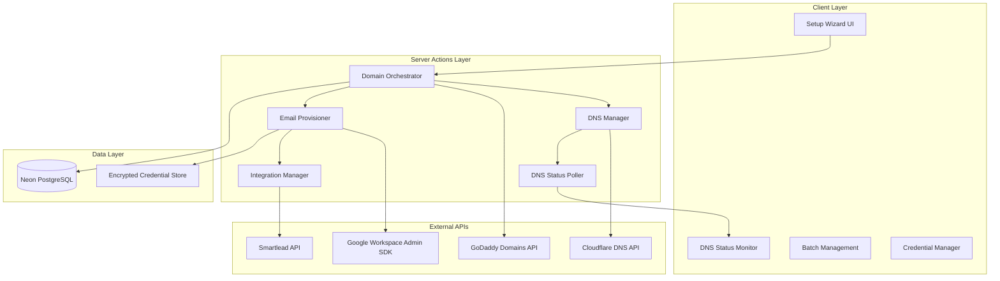

# Email Infrastructure Setup Tool Design Document

## Overview

The Email Infrastructure Setup Tool is a comprehensive automation system that streamlines the process of configuring professional email infrastructure for cold email campaigns. The system handles domain connection (with optional GoDaddy purchase), automated DNS authentication configuration via Cloudflare API (SPF, DKIM, DMARC, MX records), real-time DNS propagation monitoring, Google Workspace email account provisioning, and seamless Smartlead integration for cold email campaigns.

This tool eliminates the 45+ minute manual setup process per domain, ensuring 95%+ email authentication success rates and 100% compliance with Gmail/Yahoo/Outlook 2025 sender requirements. The unified Next.js 15 architecture leverages Server Actions with TanStack Query for real-time status updates and parallel batch processing.

## Architecture

### High-Level Architecture



### Technology Stack

**Frontend Components**

- Next.js 15 App Router with React 19 for server-side rendering and progressive wizard interface
- shadcn/ui component library with dark theme design system and custom wizard components
- TanStack Query for real-time DNS polling (30-second intervals), email provisioning status, and optimistic updates
- Lucide React icons for visual status indicators (checkmarks, spinners, warnings)
- Tailwind CSS with responsive design for desktop and mobile setup workflows

**Backend Services**

- Next.js 15 Server Actions for domain orchestration, DNS automation, and email provisioning
- Cloudflare API client for DNS record management, SPF flattening, and propagation monitoring
- GoDaddy Domains API (optional) for domain availability search and registration
- Google Workspace Admin SDK Directory API for email account creation and SMTP/IMAP configuration
- Smartlead API client for email account connection and tracking domain setup
- Drizzle ORM for type-safe database operations and encrypted credential storage

**Infrastructure**

- Vercel deployment with Server Actions for domain and email workflows
- Neon PostgreSQL for domain metadata, DNS records, email accounts, and setup status tracking
- AES-256 encryption for email credentials and API keys storage
- Background job queue (BullMQ/Inngest) for DNS polling, batch operations, and async email provisioning
- Rate limiting middleware for API protection and external service quota management

## Components and Interfaces

### Core Components

#### 1. Domain Orchestrator

```typescript
interface DomainOrchestrator {
  connectDomain(domain: string, userId: string): Promise<DomainSetup>;
  purchaseDomain(domainName: string, userId: string): Promise<DomainPurchase>;
  verifyNameservers(domain: string): Promise<NameserverStatus>;
  initiateDNSSetup(domainId: string): Promise<DNSSetupResult>;
  getBatchStatus(batchId: string): Promise<BatchStatus>;
}

interface DomainSetup {
  id: string;
  domain: string;
  userId: string;
  status: 'pending_nameservers' | 'nameservers_verified' | 'dns_configuring' | 'dns_propagating' | 'ready' | 'failed';
  nameservers: {
    required: string[];
    current: string[];
    verified: boolean;
  };
  setupInstructions: SetupInstruction[];
  createdAt: Date;
}

interface DomainPurchase {
  domain: string;
  registrar: 'godaddy';
  price: number;
  status: 'checking_availability' | 'available' | 'unavailable' | 'purchasing' | 'purchased' | 'failed';
  purchaseId?: string;
  autoConfigureCloudflare: boolean;
}

interface SetupInstruction {
  step: number;
  title: string;
  description: string;
  registrar?: 'godaddy' | 'namecheap' | 'porkbun' | 'other';
  action: string;
  helpUrl?: string;
}
```

#### 2. DNS Manager

```typescript
interface DNSManager {
  configureDNS(domainId: string, config: DNSConfig): Promise<DNSSetupResult>;
  createSPFRecord(domain: string, sendingServices: string[]): Promise<DNSRecord>;
  flattenSPFRecord(spfRecord: string): Promise<string>;
  createDKIMRecords(domain: string, provider: 'google'): Promise<DNSRecord[]>;
  createDMARCRecord(domain: string, policy: DMARCPolicy): Promise<DNSRecord>;
  createMXRecords(domain: string, provider: 'google'): Promise<DNSRecord[]>;
  createTrackingDomainCNAME(domain: string, trackingSubdomain: string): Promise<DNSRecord>;
  validateDNSRecords(domain: string): Promise<DNSValidationResult>;
}

interface DNSConfig {
  domain: string;
  emailProvider: 'google_workspace';
  sendingServices: string[]; // ['google', 'smartlead']
  dmarcPolicy: DMARCPolicy;
  customTrackingDomain?: string;
  enableSPFFlattening: boolean;
}

interface DNSRecord {
  type: 'TXT' | 'MX' | 'CNAME';
  name: string;
  value: string;
  ttl: number;
  priority?: number;
  cloudflareId?: string;
  status: 'pending' | 'created' | 'propagated' | 'failed';
}

interface DMARCPolicy {
  policy: 'none' | 'quarantine' | 'reject';
  reportEmail: string;
  percentage: number; // 0-100
  forensicReports: boolean;
}

interface DNSSetupResult {
  success: boolean;
  recordsCreated: DNSRecord[];
  spfFlattened: boolean;
  estimatedPropagation: number; // seconds
  cloudflareZoneId: string;
}

interface DNSValidationResult {
  domain: string;
  spf: { valid: boolean; record?: string; lookupCount: number; errors: string[] };
  dkim: { valid: boolean; selector: string; publicKey?: string; errors: string[] };
  dmarc: { valid: boolean; policy?: string; errors: string[] };
  mx: { valid: boolean; records: string[]; errors: string[] };
  compliance: {
    gmail: boolean;
    yahoo: boolean;
    outlook: boolean;
    issues: string[];
  };
}
```

#### 3. DNS Status Poller

```typescript
interface DNSStatusPoller {
  startPolling(domainId: string, records: DNSRecord[]): Promise<PollingSession>;
  stopPolling(sessionId: string): Promise<void>;
  checkPropagationStatus(domain: string, record: DNSRecord): Promise<PropagationStatus>;
  getPollingProgress(sessionId: string): Promise<PollingProgress>;
}

interface PollingSession {
  id: string;
  domainId: string;
  status: 'polling' | 'completed' | 'timeout' | 'cancelled';
  startedAt: Date;
  estimatedCompletion?: Date;
  checkInterval: number; // 30 seconds
  maxDuration: number; // 48 hours
}

interface PropagationStatus {
  record: DNSRecord;
  propagated: boolean;
  checkedServers: number;
  propagatedServers: number;
  globalCoverage: number; // 0-100%
  lastChecked: Date;
  ttl: number;
}

interface PollingProgress {
  sessionId: string;
  totalRecords: number;
  propagatedRecords: number;
  overallProgress: number; // 0-100%
  recordStatuses: {
    recordType: string;
    name: string;
    status: 'pending' | 'propagating' | 'propagated';
    coverage: number;
  }[];
  estimatedCompletion?: Date;
}
```

#### 4. Email Provisioner

```typescript
interface EmailProvisioner {
  createEmailAccount(config: EmailAccountConfig): Promise<EmailAccount>;
  batchCreateAccounts(configs: EmailAccountConfig[]): Promise<EmailAccount[]>;
  configureIMAPSMTP(account: EmailAccount): Promise<EmailCredentials>;
  testEmailAuthentication(account: EmailAccount): Promise<AuthenticationTest>;
  exportCredentials(accountIds: string[], format: 'csv' | 'json'): Promise<string>;
}

interface EmailAccountConfig {
  domainId: string;
  username: string; // e.g., 'john' for john@domain.com
  firstName: string;
  lastName: string;
  password?: string; // Auto-generate if not provided
  dailySendingLimit?: number; // Default: 50
}

interface EmailAccount {
  id: string;
  domainId: string;
  email: string;
  password: string; // Encrypted in storage
  firstName: string;
  lastName: string;
  status: 'creating' | 'created' | 'failed' | 'active' | 'suspended';
  googleWorkspaceId?: string;
  smartleadId?: string;
  credentials: EmailCredentials;
  createdAt: Date;
}

interface EmailCredentials {
  email: string;
  password: string;
  smtp: {
    host: string;
    port: number;
    username: string;
    password: string;
    tls: boolean;
  };
  imap: {
    host: string;
    port: number;
    username: string;
    password: string;
    tls: boolean;
  };
}

interface AuthenticationTest {
  accountId: string;
  email: string;
  spfPass: boolean;
  dkimPass: boolean;
  dmarcPass: boolean;
  testEmailSent: boolean;
  testEmailReceived: boolean;
  rawHeaders?: string;
  issues: string[];
}
```

#### 5. Integration Manager

```typescript
interface IntegrationManager {
  connectToSmartlead(account: EmailAccount, smartleadConfig: SmartleadConfig): Promise<SmartleadConnection>;
  batchConnectToSmartlead(accounts: EmailAccount[], config: SmartleadConfig): Promise<SmartleadConnection[]>;
  setupTrackingDomain(domainId: string, trackingSubdomain: string): Promise<TrackingDomainSetup>;
  validateSmartleadConnection(connectionId: string): Promise<ValidationResult>;
}

interface SmartleadConfig {
  apiKey: string;
  warmupEnabled: boolean;
  dailyLimit: number;
  replyRate: number; // Target reply rate for warmup
  warmupDuration: number; // Days
}

interface SmartleadConnection {
  id: string;
  accountId: string;
  smartleadEmailId: string;
  status: 'connecting' | 'connected' | 'failed' | 'disconnected';
  warmupEnabled: boolean;
  dailyLimit: number;
  trackingDomain?: string;
  lastSync: Date;
  errors: string[];
}

interface TrackingDomainSetup {
  domainId: string;
  trackingSubdomain: string; // e.g., 'track.domain.com'
  cnameRecord: DNSRecord;
  smartleadVerified: boolean;
  status: 'pending' | 'dns_created' | 'propagating' | 'verified' | 'failed';
}
```

#### 6. SPF Flattening Service

```typescript
interface SPFFlattener {
  flattenSPFRecord(domain: string, existingSPF?: string): Promise<FlattenedSPF>;
  validateLookupCount(spfRecord: string): Promise<SPFValidation>;
  resolveIncludesToIPs(includes: string[]): Promise<ResolvedIP[]>;
  compressSPFRecord(ips: ResolvedIP[]): Promise<string>;
}

interface FlattenedSPF {
  original: string;
  flattened: string;
  lookupCount: {
    before: number;
    after: number;
  };
  ipv4Addresses: string[];
  ipv6Addresses: string[];
  includesResolved: string[];
  charactersUsed: number; // SPF has 512 char limit
  estimatedPropagation: number;
}

interface SPFValidation {
  valid: boolean;
  lookupCount: number;
  exceedsLimit: boolean; // More than 10 lookups
  issues: string[];
  recommendations: string[];
}

interface ResolvedIP {
  include: string;
  ipv4: string[];
  ipv6: string[];
  resolvedAt: Date;
}
```

### API Endpoints (Server Actions)

#### Domain Management Actions

```typescript
// app/actions/domain.actions.ts
'use server'

export async function connectDomain(domain: string): Promise<DomainSetup>;
export async function purchaseDomain(domainName: string): Promise<DomainPurchase>;
export async function verifyNameservers(domainId: string): Promise<NameserverStatus>;
export async function initiateDNSSetup(domainId: string, config: DNSConfig): Promise<DNSSetupResult>;
export async function getDomainStatus(domainId: string): Promise<DomainStatus>;
export async function batchConnectDomains(domains: string[]): Promise<BatchDomainSetup>;
```

#### DNS Management Actions

```typescript
// app/actions/dns.actions.ts
'use server'

export async function configureDNSRecords(domainId: string): Promise<DNSSetupResult>;
export async function flattenSPF(domainId: string): Promise<FlattenedSPF>;
export async function updateDMARCPolicy(domainId: string, policy: DMARCPolicy): Promise<DNSRecord>;
export async function validateDNSSetup(domainId: string): Promise<DNSValidationResult>;
export async function pollDNSPropagation(domainId: string): Promise<PollingProgress>;
export async function testEmailAuthentication(domainId: string): Promise<AuthenticationTest>;
```

#### Email Provisioning Actions

```typescript
// app/actions/email.actions.ts
'use server'

export async function createEmailAccount(config: EmailAccountConfig): Promise<EmailAccount>;
export async function batchCreateEmailAccounts(configs: EmailAccountConfig[]): Promise<EmailAccount[]>;
export async function getEmailCredentials(accountId: string): Promise<EmailCredentials>;
export async function exportEmailCredentials(accountIds: string[], format: 'csv' | 'json'): Promise<Blob>;
export async function testEmailAccount(accountId: string): Promise<AuthenticationTest>;
```

#### Smartlead Integration Actions

```typescript
// app/actions/smartlead.actions.ts
'use server'

export async function connectToSmartlead(accountId: string, config: SmartleadConfig): Promise<SmartleadConnection>;
export async function batchConnectToSmartlead(accountIds: string[], config: SmartleadConfig): Promise<SmartleadConnection[]>;
export async function setupTrackingDomain(domainId: string, subdomain: string): Promise<TrackingDomainSetup>;
export async function validateSmartleadConnection(connectionId: string): Promise<ValidationResult>;
```

### Data Models

#### Database Schema

```sql
-- Domain Management
CREATE TABLE domains (
  id UUID PRIMARY KEY DEFAULT gen_random_uuid(),
  user_id UUID NOT NULL REFERENCES neon_auth.users_sync(id) ON DELETE CASCADE,
  domain_name VARCHAR(255) NOT NULL UNIQUE,
  registrar VARCHAR(50), -- 'godaddy', 'namecheap', 'other'
  purchased_via_platform BOOLEAN DEFAULT FALSE,
  status VARCHAR(50) NOT NULL DEFAULT 'pending_nameservers',
  nameservers_verified BOOLEAN DEFAULT FALSE,
  nameservers_verified_at TIMESTAMPTZ,
  cloudflare_zone_id VARCHAR(255),
  cloudflare_account_id VARCHAR(255),
  setup_instructions JSONB,
  created_at TIMESTAMPTZ DEFAULT CURRENT_TIMESTAMP,
  updated_at TIMESTAMPTZ DEFAULT CURRENT_TIMESTAMP
);

-- DNS Records
CREATE TABLE dns_records (
  id UUID PRIMARY KEY DEFAULT gen_random_uuid(),
  domain_id UUID NOT NULL REFERENCES domains(id) ON DELETE CASCADE,
  record_type VARCHAR(10) NOT NULL CHECK (record_type IN ('TXT', 'MX', 'CNAME', 'A', 'AAAA')),
  name VARCHAR(255) NOT NULL,
  value TEXT NOT NULL,
  ttl INTEGER DEFAULT 300,
  priority INTEGER,
  cloudflare_record_id VARCHAR(255),
  status VARCHAR(50) DEFAULT 'pending',
  propagation_status JSONB, -- {propagated: boolean, coverage: number, lastChecked: timestamp}
  created_at TIMESTAMPTZ DEFAULT CURRENT_TIMESTAMP,
  propagated_at TIMESTAMPTZ
);

-- SPF Configuration
CREATE TABLE spf_configurations (
  id UUID PRIMARY KEY DEFAULT gen_random_uuid(),
  domain_id UUID NOT NULL REFERENCES domains(id) ON DELETE CASCADE,
  original_record TEXT,
  flattened_record TEXT NOT NULL,
  lookup_count_before INTEGER,
  lookup_count_after INTEGER,
  ipv4_addresses TEXT[],
  ipv6_addresses TEXT[],
  includes_resolved JSONB,
  flattened_at TIMESTAMPTZ DEFAULT CURRENT_TIMESTAMP,
  last_updated TIMESTAMPTZ DEFAULT CURRENT_TIMESTAMP
);

-- DMARC Configuration
CREATE TABLE dmarc_configurations (
  id UUID PRIMARY KEY DEFAULT gen_random_uuid(),
  domain_id UUID NOT NULL REFERENCES domains(id) ON DELETE CASCADE,
  policy VARCHAR(20) NOT NULL CHECK (policy IN ('none', 'quarantine', 'reject')),
  report_email VARCHAR(255) NOT NULL,
  percentage INTEGER DEFAULT 100 CHECK (percentage BETWEEN 0 AND 100),
  forensic_reports BOOLEAN DEFAULT FALSE,
  aggregate_report_emails TEXT[],
  created_at TIMESTAMPTZ DEFAULT CURRENT_TIMESTAMP,
  updated_at TIMESTAMPTZ DEFAULT CURRENT_TIMESTAMP
);

-- Email Accounts
CREATE TABLE email_accounts (
  id UUID PRIMARY KEY DEFAULT gen_random_uuid(),
  domain_id UUID NOT NULL REFERENCES domains(id) ON DELETE CASCADE,
  user_id UUID NOT NULL REFERENCES neon_auth.users_sync(id) ON DELETE CASCADE,
  email VARCHAR(255) NOT NULL UNIQUE,
  username VARCHAR(255) NOT NULL,
  first_name VARCHAR(100) NOT NULL,
  last_name VARCHAR(100) NOT NULL,
  password_encrypted TEXT NOT NULL, -- AES-256 encrypted
  status VARCHAR(50) DEFAULT 'creating',
  google_workspace_id VARCHAR(255),
  daily_sending_limit INTEGER DEFAULT 50,
  created_at TIMESTAMPTZ DEFAULT CURRENT_TIMESTAMP,
  updated_at TIMESTAMPTZ DEFAULT CURRENT_TIMESTAMP
);

-- Smartlead Connections
CREATE TABLE smartlead_connections (
  id UUID PRIMARY KEY DEFAULT gen_random_uuid(),
  email_account_id UUID NOT NULL REFERENCES email_accounts(id) ON DELETE CASCADE,
  smartlead_email_id VARCHAR(255),
  status VARCHAR(50) DEFAULT 'connecting',
  warmup_enabled BOOLEAN DEFAULT TRUE,
  daily_limit INTEGER DEFAULT 50,
  reply_rate INTEGER, -- Target reply rate for warmup
  warmup_duration INTEGER, -- Days
  tracking_domain VARCHAR(255),
  last_sync TIMESTAMPTZ,
  errors JSONB,
  created_at TIMESTAMPTZ DEFAULT CURRENT_TIMESTAMP,
  updated_at TIMESTAMPTZ DEFAULT CURRENT_TIMESTAMP
);

-- DNS Polling Sessions
CREATE TABLE dns_polling_sessions (
  id UUID PRIMARY KEY DEFAULT gen_random_uuid(),
  domain_id UUID NOT NULL REFERENCES domains(id) ON DELETE CASCADE,
  status VARCHAR(50) DEFAULT 'polling',
  total_records INTEGER NOT NULL,
  propagated_records INTEGER DEFAULT 0,
  overall_progress INTEGER DEFAULT 0,
  check_interval INTEGER DEFAULT 30, -- seconds
  max_duration INTEGER DEFAULT 172800, -- 48 hours in seconds
  started_at TIMESTAMPTZ DEFAULT CURRENT_TIMESTAMP,
  completed_at TIMESTAMPTZ,
  estimated_completion TIMESTAMPTZ
);

-- Batch Operations
CREATE TABLE batch_operations (
  id UUID PRIMARY KEY DEFAULT gen_random_uuid(),
  user_id UUID NOT NULL REFERENCES neon_auth.users_sync(id) ON DELETE CASCADE,
  operation_type VARCHAR(50) NOT NULL CHECK (operation_type IN ('domain_connect', 'dns_setup', 'email_provision', 'smartlead_connect')),
  total_items INTEGER NOT NULL,
  completed_items INTEGER DEFAULT 0,
  failed_items INTEGER DEFAULT 0,
  status VARCHAR(50) DEFAULT 'processing',
  metadata JSONB,
  created_at TIMESTAMPTZ DEFAULT CURRENT_TIMESTAMP,
  completed_at TIMESTAMPTZ
);

-- Indexes for performance
CREATE INDEX idx_domains_user_id ON domains(user_id);
CREATE INDEX idx_domains_status ON domains(status);
CREATE INDEX idx_dns_records_domain_id ON dns_records(domain_id);
CREATE INDEX idx_dns_records_status ON dns_records(status);
CREATE INDEX idx_email_accounts_domain_id ON email_accounts(domain_id);
CREATE INDEX idx_email_accounts_user_id ON email_accounts(user_id);
CREATE INDEX idx_smartlead_connections_account_id ON smartlead_connections(email_account_id);
CREATE INDEX idx_dns_polling_sessions_domain_id ON dns_polling_sessions(domain_id);
CREATE INDEX idx_batch_operations_user_id ON batch_operations(user_id);
```

#### Client-Side State Models

```typescript
interface SetupWizardState {
  currentStep: number;
  domainSetup?: DomainSetup;
  dnsStatus?: PollingProgress;
  emailAccounts: EmailAccount[];
  smartleadConnections: SmartleadConnection[];
  isLoading: boolean;
  error?: string;

  // Actions
  connectDomain: (domain: string) => Promise<void>;
  purchaseDomain: (domainName: string) => Promise<void>;
  configureDNS: (domainId: string) => Promise<void>;
  createEmailAccounts: (configs: EmailAccountConfig[]) => Promise<void>;
  connectToSmartlead: (config: SmartleadConfig) => Promise<void>;
  nextStep: () => void;
  previousStep: () => void;
  resetWizard: () => void;
}

interface DomainDashboardState {
  domains: DomainSetup[];
  selectedDomain?: DomainSetup;
  dnsValidation?: DNSValidationResult;
  emailAccounts: EmailAccount[];
  isPolling: boolean;

  // Actions
  fetchDomains: () => Promise<void>;
  selectDomain: (domainId: string) => void;
  validateDNS: (domainId: string) => Promise<void>;
  testEmailAuth: (accountId: string) => Promise<void>;
}
```

## Error Handling

### Error Categories and Handling Strategy

#### 1. Domain and Nameserver Errors

```typescript
class DomainErrorHandler {
  static handle(error: DomainError): ErrorResponse {
    switch (error.type) {
      case 'NAMESERVER_NOT_UPDATED':
        return {
          message: 'Nameservers not yet updated. This can take up to 48 hours.',
          action: 'retry_verification',
          fallback: 'manual_verification',
          retryable: true,
          retryDelay: 300000, // 5 minutes
          helpUrl: '/docs/nameserver-setup',
        };
      case 'DOMAIN_ALREADY_EXISTS':
        return {
          message: 'This domain is already configured in your account.',
          action: 'view_existing_domain',
          fallback: 'none',
          retryable: false,
        };
      case 'GODADDY_API_ERROR':
        return {
          message: 'GoDaddy API temporarily unavailable. Try purchasing directly or connecting existing domain.',
          action: 'show_alternative_options',
          fallback: 'manual_domain_purchase',
          retryable: true,
        };
    }
  }
}
```

#### 2. DNS Configuration Errors

```typescript
class DNSErrorHandler {
  static handle(error: DNSError): ErrorResponse {
    switch (error.type) {
      case 'CLOUDFLARE_AUTH_FAILED':
        return {
          message: 'Cloudflare authentication failed. Please check your API credentials.',
          action: 'reconfigure_cloudflare',
          fallback: 'contact_support',
          retryable: false,
        };
      case 'SPF_RECORD_TOO_LONG':
        return {
          message: 'SPF record exceeds 512 character limit. Enabling automatic SPF flattening.',
          action: 'enable_spf_flattening',
          fallback: 'reduce_sending_services',
          retryable: true,
        };
      case 'DKIM_GENERATION_FAILED':
        return {
          message: 'Failed to generate DKIM keys. Retrying with fresh keys.',
          action: 'regenerate_dkim',
          fallback: 'manual_dkim_setup',
          retryable: true,
          retryCount: 3,
        };
      case 'DNS_PROPAGATION_TIMEOUT':
        return {
          message: 'DNS propagation taking longer than expected. Records may still propagate.',
          action: 'continue_monitoring',
          fallback: 'manual_dns_check',
          retryable: false,
        };
    }
  }
}
```

#### 3. Email Provisioning Errors

```typescript
class EmailProvisioningErrorHandler {
  static handle(error: EmailError): ErrorResponse {
    switch (error.type) {
      case 'GOOGLE_WORKSPACE_AUTH_FAILED':
        return {
          message: 'Google Workspace authentication failed. Please verify domain ownership and service account permissions.',
          action: 'show_google_setup_guide',
          fallback: 'manual_account_creation',
          retryable: false,
          helpUrl: '/docs/google-workspace-setup',
        };
      case 'EMAIL_ALREADY_EXISTS':
        return {
          message: 'This email address already exists in Google Workspace.',
          action: 'suggest_alternative_username',
          fallback: 'skip_account',
          retryable: false,
        };
      case 'WORKSPACE_QUOTA_EXCEEDED':
        return {
          message: 'Google Workspace account limit reached. Please upgrade your plan.',
          action: 'show_upgrade_options',
          fallback: 'stop_provisioning',
          retryable: false,
        };
      case 'WEAK_PASSWORD':
        return {
          message: 'Password does not meet Google Workspace requirements. Generating stronger password.',
          action: 'regenerate_password',
          fallback: 'manual_password_entry',
          retryable: true,
        };
    }
  }
}
```

#### 4. Smartlead Integration Errors

```typescript
class SmartleadErrorHandler {
  static handle(error: SmartleadError): ErrorResponse {
    switch (error.type) {
      case 'SMARTLEAD_API_KEY_INVALID':
        return {
          message: 'Smartlead API key is invalid or expired. Please check your Smartlead settings.',
          action: 'update_api_key',
          fallback: 'manual_connection',
          retryable: false,
          helpUrl: '/docs/smartlead-integration',
        };
      case 'EMAIL_ALREADY_CONNECTED':
        return {
          message: 'This email account is already connected to Smartlead.',
          action: 'view_existing_connection',
          fallback: 'skip_connection',
          retryable: false,
        };
      case 'TRACKING_DOMAIN_SETUP_FAILED':
        return {
          message: 'Custom tracking domain setup failed. Email account connected without custom tracking.',
          action: 'retry_tracking_setup',
          fallback: 'use_default_tracking',
          retryable: true,
        };
      case 'SMARTLEAD_RATE_LIMIT':
        return {
          message: 'Smartlead API rate limit reached. Retrying in 60 seconds.',
          action: 'queue_for_retry',
          fallback: 'manual_connection',
          retryable: true,
          retryDelay: 60000,
        };
    }
  }
}
```

### Global Error Handling

```typescript
class GlobalErrorBoundary {
  static async handleSetupError(error: Error, context: SetupContext): Promise<void> {
    // Log error with full context
    console.error(`Setup Error [${context.domainId}]:`, error);

    // Update setup status in database
    await updateDomainStatus(context.domainId, {
      status: 'failed',
      error: error.message,
      errorContext: context,
    });

    // Notify user through real-time updates
    await notifySetupProgress(context.domainId, {
      status: 'failed',
      error: this.getUserFriendlyMessage(error),
      suggestedAction: this.getSuggestedAction(error),
    });

    // Attempt graceful degradation or rollback
    if (error.recoverable) {
      await this.attemptRecovery(context, error);
    } else {
      await this.rollbackChanges(context);
    }
  }

  private static getUserFriendlyMessage(error: Error): string {
    const errorMessages = {
      'Cloudflare API error': 'DNS configuration temporarily unavailable. Our team has been notified.',
      'Google Workspace API error': 'Email account creation failed. Please verify your Google Workspace settings.',
      'Smartlead API error': 'Smartlead connection failed. Please check your API key and try again.',
      'Network timeout': 'Connection timeout. Please check your internet connection and try again.',
    };

    return errorMessages[error.type] || 'An unexpected error occurred. Please try again or contact support.';
  }

  private static async rollbackChanges(context: SetupContext): Promise<void> {
    // Rollback DNS changes if email provisioning failed
    if (context.step === 'email_provisioning' && context.dnsConfigured) {
      await this.cleanupDNSRecords(context.domainId);
    }

    // Delete partially created email accounts
    if (context.emailAccountsCreated?.length > 0) {
      await this.cleanupEmailAccounts(context.emailAccountsCreated);
    }
  }
}
```

## Testing Strategy

### Testing Approach

#### 1. Unit Tests (55%)

```typescript
describe('SPF Flattener', () => {
  describe('flattenSPFRecord', () => {
    it('should flatten SPF record with more than 10 DNS lookups', async () => {
      const domain = 'example.com';
      const originalSPF = 'v=spf1 include:_spf.google.com include:sendgrid.net include:servers.mcsv.net ~all';

      const result = await spfFlattener.flattenSPFRecord(domain, originalSPF);

      expect(result.lookupCount.before).toBeGreaterThan(10);
      expect(result.lookupCount.after).toBeLessThanOrEqual(10);
      expect(result.flattened).toContain('ip4:');
    });

    it('should handle SPF record length limits (512 chars)', async () => {
      const domain = 'example.com';
      const longSPF = 'v=spf1 ' + 'include:service.com '.repeat(30) + '~all';

      const result = await spfFlattener.flattenSPFRecord(domain, longSPF);

      expect(result.charactersUsed).toBeLessThanOrEqual(512);
      expect(result.flattened.length).toBeLessThanOrEqual(512);
    });
  });
});

describe('DNS Manager', () => {
  it('should create Google Workspace MX records with correct priority', async () => {
    const domain = 'example.com';

    const mxRecords = await dnsManager.createMXRecords(domain, 'google');

    expect(mxRecords).toHaveLength(5);
    expect(mxRecords[0].priority).toBe(1);
    expect(mxRecords[0].value).toBe('aspmx.l.google.com');
  });

  it('should generate DKIM records for Google Workspace', async () => {
    const domain = 'example.com';

    const dkimRecords = await dnsManager.createDKIMRecords(domain, 'google');

    expect(dkimRecords).toHaveLength(1);
    expect(dkimRecords[0].name).toContain('._domainkey');
    expect(dkimRecords[0].type).toBe('TXT');
  });
});
```

#### 2. Integration Tests (30%)

```typescript
describe('Full Domain Setup Workflow', () => {
  it('should complete domain connection and DNS setup', async () => {
    const domain = 'test-domain.com';
    const userId = 'test-user-id';

    // Step 1: Connect domain
    const domainSetup = await domainOrchestrator.connectDomain(domain, userId);
    expect(domainSetup.status).toBe('pending_nameservers');

    // Step 2: Simulate nameserver verification
    await simulateNameserverUpdate(domain);
    const nsStatus = await domainOrchestrator.verifyNameservers(domain);
    expect(nsStatus.verified).toBe(true);

    // Step 3: Configure DNS
    const dnsConfig = {
      domain,
      emailProvider: 'google_workspace',
      sendingServices: ['google', 'smartlead'],
      dmarcPolicy: { policy: 'none', reportEmail: 'dmarc@test-domain.com', percentage: 100, forensicReports: false },
      enableSPFFlattening: true,
    };
    const dnsResult = await dnsManager.configureDNS(domainSetup.id, dnsConfig);

    expect(dnsResult.success).toBe(true);
    expect(dnsResult.recordsCreated.length).toBeGreaterThan(0);
    expect(dnsResult.spfFlattened).toBe(true);
  });

  it('should handle batch domain setup', async () => {
    const domains = ['domain1.com', 'domain2.com', 'domain3.com'];
    const userId = 'test-user-id';

    const batchResult = await domainOrchestrator.batchConnectDomains(domains, userId);

    expect(batchResult.totalDomains).toBe(3);
    expect(batchResult.status).toBe('processing');

    // Wait for completion
    const finalStatus = await waitForBatchCompletion(batchResult.batchId, 60000);
    expect(finalStatus.completedDomains).toBe(3);
  });
});

describe('Email Provisioning Integration', () => {
  it('should create email account and connect to Smartlead', async () => {
    const domainId = 'test-domain-id';
    const accountConfig = {
      domainId,
      username: 'john',
      firstName: 'John',
      lastName: 'Doe',
      dailySendingLimit: 50,
    };

    // Create email account
    const account = await emailProvisioner.createEmailAccount(accountConfig);
    expect(account.status).toBe('created');
    expect(account.email).toBe('john@test-domain.com');

    // Connect to Smartlead
    const smartleadConfig = {
      apiKey: process.env.SMARTLEAD_API_KEY,
      warmupEnabled: true,
      dailyLimit: 50,
      replyRate: 30,
      warmupDuration: 14,
    };
    const connection = await integrationManager.connectToSmartlead(account, smartleadConfig);

    expect(connection.status).toBe('connected');
    expect(connection.smartleadEmailId).toBeDefined();
  });
});
```

#### 3. E2E Tests (15%)

```typescript
describe('Email Infrastructure Setup Wizard E2E', () => {
  it('should complete full setup workflow from domain to Smartlead', async () => {
    // Navigate to setup wizard
    await page.goto('/setup/domain');

    // Step 1: Connect domain
    await page.fill('[data-testid=domain-input]', 'e2e-test.com');
    await page.click('[data-testid=connect-domain]');

    // Wait for nameserver instructions
    await expect(page.locator('[data-testid=nameserver-instructions]')).toBeVisible();

    // Simulate nameserver update (mocked)
    await page.click('[data-testid=verify-nameservers]');

    // Step 2: DNS configuration
    await page.waitForSelector('[data-testid=dns-status-monitor]', { timeout: 30000 });
    await expect(page.locator('[data-testid=spf-status]')).toContainText('Propagated');

    // Step 3: Email account creation
    await page.click('[data-testid=next-step]');
    await page.fill('[data-testid=email-username]', 'test');
    await page.click('[data-testid=create-account]');

    // Wait for email creation
    await page.waitForSelector('[data-testid=email-created]', { timeout: 15000 });

    // Step 4: Smartlead connection
    await page.click('[data-testid=next-step]');
    await page.fill('[data-testid=smartlead-api-key]', 'test-api-key');
    await page.click('[data-testid=connect-smartlead]');

    // Verify completion
    await expect(page.locator('[data-testid=setup-complete]')).toBeVisible();
    expect(await page.locator('[data-testid=success-message]').textContent()).toContain('Setup Complete');
  });
});
```

### Testing Tools and Configuration

**Unit Testing**

- Vitest for fast unit testing with TypeScript support
- MSW (Mock Service Worker) for API mocking (Cloudflare, GoDaddy, Google, Smartlead)
- Test databases with Docker containers for isolated testing

**Integration Testing**

- Playwright for API testing and browser automation
- Test Cloudflare API with staging zones
- Mock Google Workspace and Smartlead APIs for safe testing
- Redis and PostgreSQL test containers

**E2E Testing**

- Playwright for cross-browser testing
- Visual regression testing with Percy or Chromatic
- Test with real domain setup workflow (sandboxed test domains)

## Platform-Specific Considerations

### Batch Operations Architecture

```typescript
interface BatchProcessor {
  processBatch<T>(items: T[], processor: (item: T) => Promise<any>, options: BatchOptions): Promise<BatchResult>;
}

interface BatchOptions {
  concurrency: number; // Max parallel operations
  retryAttempts: number;
  retryDelay: number; // ms
  onProgress?: (completed: number, total: number) => void;
  onError?: (item: any, error: Error) => void;
}

class DomainBatchProcessor implements BatchProcessor {
  async processBatch(
    domains: string[],
    processor: (domain: string) => Promise<DomainSetup>,
    options: BatchOptions = { concurrency: 10, retryAttempts: 3, retryDelay: 5000 }
  ): Promise<BatchResult> {
    const results: DomainSetup[] = [];
    const errors: { domain: string; error: Error }[] = [];

    // Process domains in parallel batches
    for (let i = 0; i < domains.length; i += options.concurrency) {
      const batch = domains.slice(i, i + options.concurrency);
      const batchResults = await Promise.allSettled(
        batch.map(domain => this.processWithRetry(domain, processor, options))
      );

      batchResults.forEach((result, index) => {
        if (result.status === 'fulfilled') {
          results.push(result.value);
        } else {
          errors.push({ domain: batch[index], error: result.reason });
          options.onError?.(batch[index], result.reason);
        }
      });

      options.onProgress?.(results.length + errors.length, domains.length);
    }

    return {
      successful: results,
      failed: errors,
      totalProcessed: results.length + errors.length,
      successRate: (results.length / domains.length) * 100,
    };
  }

  private async processWithRetry<T>(
    item: T,
    processor: (item: T) => Promise<any>,
    options: BatchOptions,
    attempt: number = 1
  ): Promise<any> {
    try {
      return await processor(item);
    } catch (error) {
      if (attempt < options.retryAttempts) {
        await new Promise(resolve => setTimeout(resolve, options.retryDelay * attempt));
        return this.processWithRetry(item, processor, options, attempt + 1);
      }
      throw error;
    }
  }
}
```

### Real-Time Status Updates with TanStack Query

```typescript
// hooks/useDNSStatus.ts
import { useQuery } from '@tanstack/react-query';

export function useDNSStatus(domainId: string) {
  return useQuery({
    queryKey: ['dns-status', domainId],
    queryFn: () => pollDNSPropagation(domainId),
    refetchInterval: 30000, // 30 seconds
    enabled: !!domainId,
    staleTime: 25000, // Slightly less than refetch interval
  });
}

// hooks/useEmailProvisioning.ts
export function useEmailProvisioning(domainId: string) {
  const queryClient = useQueryClient();

  const createAccount = useMutation({
    mutationFn: (config: EmailAccountConfig) => createEmailAccount(config),
    onSuccess: () => {
      queryClient.invalidateQueries({ queryKey: ['email-accounts', domainId] });
    },
    onError: (error) => {
      toast.error(`Failed to create email account: ${error.message}`);
    },
  });

  return { createAccount };
}
```

## Performance Considerations

### Performance Requirements

- Domain connection initiation: < 2 seconds response time
- DNS record creation: < 30 seconds for all records via Cloudflare API
- DNS status polling: 30-second intervals with < 2 second query response
- Email account creation: < 5 seconds per account via Google Workspace API
- Batch operations: Process 50 domains in < 15 minutes
- Dashboard loading: < 1 second for domain list and status

### Optimization Strategies

**DNS Propagation Monitoring**

```typescript
class DNSPropagationOptimizer {
  private cache: Map<string, PropagationStatus> = new Map();

  async checkPropagation(domain: string, record: DNSRecord): Promise<PropagationStatus> {
    const cacheKey = `${domain}-${record.type}-${record.name}`;
    const cached = this.cache.get(cacheKey);

    // Use cached result if checked within last 25 seconds
    if (cached && Date.now() - cached.lastChecked.getTime() < 25000) {
      return cached;
    }

    // Check propagation across multiple DNS servers
    const servers = ['8.8.8.8', '1.1.1.1', '208.67.222.222']; // Google, Cloudflare, OpenDNS
    const results = await Promise.all(
      servers.map(server => this.queryDNS(domain, record, server))
    );

    const propagatedCount = results.filter(r => r.success).length;
    const status: PropagationStatus = {
      record,
      propagated: propagatedCount === servers.length,
      checkedServers: servers.length,
      propagatedServers: propagatedCount,
      globalCoverage: (propagatedCount / servers.length) * 100,
      lastChecked: new Date(),
      ttl: record.ttl,
    };

    this.cache.set(cacheKey, status);
    return status;
  }
}
```

**Batch Processing Optimization**

```typescript
// Process domains in parallel with rate limiting
class RateLimitedBatchProcessor {
  private queue: PQueue;

  constructor(concurrency: number = 10) {
    this.queue = new PQueue({ concurrency, interval: 1000, intervalCap: concurrency });
  }

  async processDomains(domains: string[]): Promise<DomainSetup[]> {
    const tasks = domains.map(domain =>
      this.queue.add(() => this.processSingleDomain(domain))
    );

    return Promise.all(tasks);
  }

  private async processSingleDomain(domain: string): Promise<DomainSetup> {
    // Implement domain connection and DNS setup
    const setup = await domainOrchestrator.connectDomain(domain);
    await dnsManager.configureDNS(setup.id);
    return setup;
  }
}
```

**Caching Strategy**

```typescript
interface CachingStrategy {
  redis: {
    dnsStatus: '25s'; // Slightly less than polling interval
    domainSetup: '5m';
    emailCredentials: '1h';
    cloudflareZones: '30m';
  };

  database: {
    domains: 'permanent';
    dnsRecords: 'permanent';
    emailAccounts: 'permanent';
    pollingHistory: '7d';
  };

  browser: {
    setupWizardState: 'session';
    domainList: '2m';
    dnsValidation: '1m';
  };
}
```

### Monitoring and Metrics

```typescript
interface InfrastructureMetrics {
  setupDuration: Histogram;
  dnsPropagationTime: Histogram;
  emailProvisioningTime: Histogram;
  batchProcessingRate: Gauge;
  cloudflareApiLatency: Histogram;
  googleWorkspaceApiLatency: Histogram;
  smartleadApiLatency: Histogram;
  errorRate: Counter;
  retryCount: Counter;
}

class PerformanceMonitor {
  static trackSetupPerformance(domainId: string, metrics: SetupMetrics): void {
    this.metrics.setupDuration.observe(metrics.totalDuration);
    this.metrics.dnsPropagationTime.observe(metrics.propagationTime);

    // Alert on slow DNS propagation (>30 minutes)
    if (metrics.propagationTime > 1800000) {
      this.alertSlowPropagation(domainId, metrics);
    }

    // Monitor API quota usage
    if (metrics.cloudflareApiCalls > 1000) {
      // Approaching rate limit
      this.alertApiQuotaWarning('Cloudflare', metrics.cloudflareApiCalls);
    }
  }
}
```

## Security Considerations

### Security Requirements

- User authentication via Stack Auth integration
- Domain ownership verification before DNS modification
- Encrypted storage (AES-256) for email passwords and API keys
- Rate limiting on all public endpoints (100 requests/hour per user)
- Input validation and sanitization for all domain inputs
- Secure API key storage in environment variables
- Audit logging for all domain and email operations

### Security Implementation

```typescript
class SecurityMiddleware {
  static async validateDomainRequest(req: DomainRequest): Promise<ValidationResult> {
    // Domain format validation
    if (!this.isValidDomain(req.domain)) {
      throw new SecurityError('Invalid domain format');
    }

    // Prevent domain hijacking
    if (await this.isDomainOwnedByOtherUser(req.domain, req.userId)) {
      throw new SecurityError('Domain already registered to another user');
    }

    // Rate limiting per user
    if (!await this.checkRateLimit(req.userId, 'domain_setup')) {
      throw new SecurityError('Rate limit exceeded. Please try again later.');
    }

    return { valid: true };
  }

  static encryptCredentials(credentials: EmailCredentials): string {
    const key = process.env.ENCRYPTION_KEY!;
    const cipher = crypto.createCipher('aes-256-cbc', key);
    let encrypted = cipher.update(JSON.stringify(credentials), 'utf8', 'hex');
    encrypted += cipher.final('hex');
    return encrypted;
  }

  static decryptCredentials(encrypted: string): EmailCredentials {
    const key = process.env.ENCRYPTION_KEY!;
    const decipher = crypto.createDecipher('aes-256-cbc', key);
    let decrypted = decipher.update(encrypted, 'hex', 'utf8');
    decrypted += decipher.final('utf8');
    return JSON.parse(decrypted);
  }
}
```

**API Key Management**

```typescript
// Environment variables (stored in Vercel)
interface EnvironmentVariables {
  CLOUDFLARE_API_TOKEN: string;
  CLOUDFLARE_ACCOUNT_ID: string;
  GODADDY_API_KEY: string;
  GODADDY_API_SECRET: string;
  GOOGLE_WORKSPACE_SERVICE_ACCOUNT: string; // JSON key
  SMARTLEAD_API_KEY: string;
  ENCRYPTION_KEY: string;
  DATABASE_URL: string;
  REDIS_URL: string;
}

// Secure API key validation
class APIKeyValidator {
  static validateCloudflare(): boolean {
    return !!process.env.CLOUDFLARE_API_TOKEN && !!process.env.CLOUDFLARE_ACCOUNT_ID;
  }

  static validateGoogleWorkspace(): boolean {
    try {
      const key = JSON.parse(process.env.GOOGLE_WORKSPACE_SERVICE_ACCOUNT!);
      return !!key.client_email && !!key.private_key;
    } catch {
      return false;
    }
  }
}
```

## Deployment and Infrastructure

### Deployment Strategy

```typescript
interface DeploymentConfig {
  vercel: {
    framework: 'nextjs';
    regions: ['iad1', 'sfo1']; // US East & West
    serverActions: {
      maxDuration: 60; // seconds
      memory: '1024mb';
    };
  };

  database: {
    provider: 'neon';
    tier: 'pro';
    region: 'us-east-1';
    connections: 100;
  };

  cache: {
    provider: 'upstash-redis';
    region: 'us-east-1';
    maxMemory: '256mb';
  };

  backgroundJobs: {
    provider: 'inngest'; // or BullMQ
    concurrency: 10;
    retries: 3;
  };
}
```

**CI/CD Pipeline**

1. **Pre-deployment Testing**
   - Run full test suite (unit + integration + E2E)
   - Database migration validation
   - API endpoint smoke tests

2. **Deployment Process**
   - Deploy to Vercel staging environment
   - Run database migrations
   - Verify external API connectivity (Cloudflare, Google, Smartlead)
   - Promote to production

3. **Post-deployment Validation**
   - Smoke tests for domain setup workflow
   - DNS propagation monitoring activation
   - Error rate monitoring and alerting

### Infrastructure Requirements

**Scaling Considerations**

```typescript
interface ScalingStrategy {
  concurrent_setups: 100; // Per region
  database_connections: 100;
  redis_connections: 200;
  background_job_workers: 10;

  auto_scaling: {
    triggers: [
      'server_action_duration > 50s',
      'error_rate > 3%',
      'dns_polling_backlog > 50'
    ];
    actions: [
      'increase_worker_count',
      'scale_database_connections',
      'enable_aggressive_caching'
    ];
  };
}
```

## Migration and Rollback

### Migration Strategy

- **Phase 1**: Deploy infrastructure with feature flags (domain connection disabled)
- **Phase 2**: Enable domain connection for beta users (10 users)
- **Phase 3**: Enable DNS automation and email provisioning
- **Phase 4**: Enable Smartlead integration and batch operations
- **Phase 5**: Full feature activation with monitoring

### Rollback Plan

```typescript
interface RollbackProcedure {
  triggers: [
    'error_rate > 5%',
    'dns_setup_failure_rate > 10%',
    'google_workspace_errors > 20%'
  ];

  automated_rollback: {
    revert_deployment: true;
    disable_new_setups: true;
    preserve_existing_data: true;
    notify_team: true;
  };

  manual_procedures: {
    dns_cleanup: 'delete_failed_records';
    email_cleanup: 'suspend_failed_accounts';
    user_notification: 'email_affected_users';
    investigation: 'error_analysis_runbook';
  };

  data_recovery: {
    cloudflare_records: 'restore_from_cloudflare_backup';
    email_accounts: 'restore_from_google_workspace';
    database: 'restore_from_neon_snapshot';
  };
}
```

## Assumptions and Dependencies

### Technical Assumptions

- Users have administrative access to their domain registrars for nameserver updates
- Users have active Google Workspace accounts with admin privileges
- Cloudflare API provides reliable DNS management and propagation is detectable
- Smartlead API remains stable and supports documented email account endpoints
- DNS propagation completes within 48 hours for 95% of domains

### External Dependencies

- **Cloudflare API**: DNS record management, SPF flattening, zone creation, propagation checks
- **GoDaddy API** (optional): Domain availability search, pricing, registration
- **Google Workspace Admin SDK**: User creation, SMTP/IMAP configuration, domain verification
- **Smartlead API**: Email account connection, warmup configuration, tracking domain setup
- **DNS Propagation Checkers**: Third-party services for global DNS validation

### Risk Mitigation

- **Cloudflare API Outages**: Implement retry logic, queue failed operations, notify users
- **Google Workspace Rate Limits**: Batch account creation with delays, implement exponential backoff
- **DNS Propagation Delays**: Set realistic expectations (48 hours), provide manual verification option
- **Smartlead API Changes**: Version API calls, implement graceful degradation, CSV export fallback
- **Security Breaches**: Encrypt all credentials, audit logging, regular security audits

---

**Requirements Traceability**: This design addresses all requirements from [requirements.md](.kiro/specs/email-infrastructure-setup/requirements.md) including:

- Domain connection with nameserver verification and optional GoDaddy purchase (R3.1-R3.5)
- Automated DNS configuration via Cloudflare API with SPF/DKIM/DMARC/MX records (R3.6-R3.11)
- Real-time DNS propagation monitoring with 30-second polling (R3.12-R3.16)
- Google Workspace email account provisioning with batch support (R3.17-R3.21)
- Smartlead integration with tracking domain setup (R3.22-R3.25)
- Compliance validation for Gmail/Yahoo/Outlook 2025 requirements (R3.26-R3.28)
- SPF flattening to avoid 10 DNS lookup limit (Advanced Features)
- DMARC policy management with progressive enforcement (Advanced Features)
- Batch domain operations for agencies and scaling (Advanced Features)

**Review Status**: Draft

**Last Updated**: 2025-09-30

**Reviewers**: Technical Lead, Product Owner, Security Engineer, DevOps Engineer
