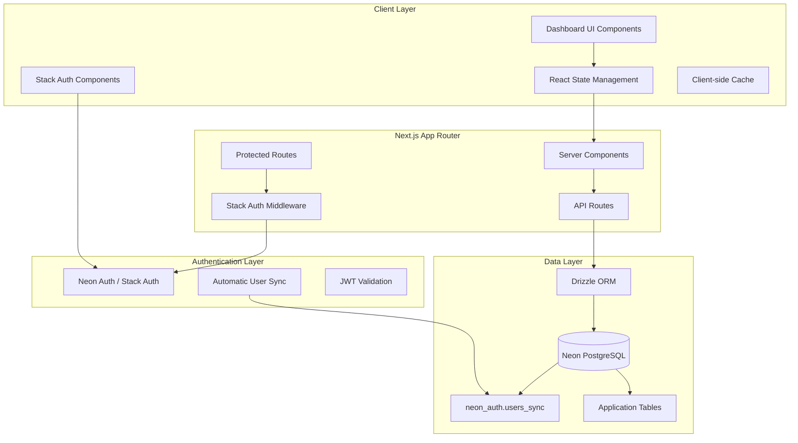

# User Authentication & Dashboard Design Document

## Overview

This design document specifies the technical implementation for the User Authentication & Dashboard feature for MailEye, a cold email management application. The feature provides secure user authentication using Neon Auth and a comprehensive dashboard for managing cold email campaigns. This is the foundational feature that enables all other platform functionality by establishing user identity, session management, and the primary user interface hub.

The design leverages Neon Auth's integrated authentication platform to eliminate complex auth implementation while maintaining full data ownership, enabling powerful user analytics, and providing a professional, scalable dashboard that serves as the command center for cold email operations.

## Architecture

### High-Level Architecture



### Technology Stack

**Frontend Components**
- Next.js 15 App Router with React 19 for modern SSR/SSG capabilities
- Stack Auth React components from `@stack-so/react` for authentication UI
- Tailwind CSS with custom design system for consistent styling
- Headless UI components for accessible, unstyled UI primitives
- React Hook Form for optimized form handling and validation

**Backend Services**
- Next.js Server Components and Server Actions (NO API routes for internal operations)
- Neon Auth service with automatic user synchronization to `neon_auth.users_sync` table
- Neon PostgreSQL with connection pooling for scalable data storage
- Drizzle ORM for type-safe database queries and migrations
- Separated data layer (`*.data.ts`) and action layer (`*.actions.ts`)

**Infrastructure**
- Vercel deployment with automatic preview deployments and edge functions
- Vercel-Neon integration with automatic environment variable configuration
- Neon PostgreSQL branching for database testing and development environments
- TanStack Query for client-side state management, caching, and optimistic updates
- Vercel Analytics for performance monitoring and user behavior tracking

## Components and Interfaces

### Core Components

#### 1. AuthenticationProvider
```typescript
interface AuthenticationState {
  user: User | null
  isLoaded: boolean
  isSignedIn: boolean
  sessionId: string | null
}

interface AuthenticationActions {
  signOut: () => Promise<void>
  redirectToSignIn: () => void
  redirectToUserProfile: () => void
}

// Stack Auth provides this through StackProvider and hooks
const useAuth = (): AuthenticationState & AuthenticationActions
const useUser = (): User | null
```

#### 2. DashboardLayout
```typescript
interface DashboardLayoutProps {
  children: React.ReactNode
  title?: string
  description?: string
  actions?: React.ReactNode
}

interface NavigationItem {
  name: string
  href: string
  icon: React.ComponentType
  current?: boolean
  disabled?: boolean
}

class DashboardLayout extends React.Component<DashboardLayoutProps> {
  render(): JSX.Element
}
```

#### 3. DashboardOverview
```typescript
interface DashboardMetrics {
  totalCampaigns: number
  totalEmailsSent: number
  replyRate: number
  bounceRate: number
  lastActivityAt?: Date
}

interface DashboardOverviewProps {
  metrics: DashboardMetrics
  isLoading: boolean
  error?: Error
}

interface QuickAction {
  title: string
  description: string
  href: string
  icon: React.ComponentType
  variant: 'primary' | 'secondary'
}

class DashboardOverview extends React.Component<DashboardOverviewProps> {
  render(): JSX.Element
}
```

#### 4. UserMetadataService
```typescript
interface UserMetadata {
  clientMetadata: {
    theme?: 'dark' | 'light'
    emailNotifications?: boolean
    pushNotifications?: boolean
    language?: string
    timezone?: string
    preferences?: Record<string, any>
  }
  serverMetadata: {
    lastLoginAt?: Date
    loginCount?: number
    securitySettings?: Record<string, any>
  }
  clientReadOnlyMetadata: {
    subscriptionPlan?: 'free' | 'pro' | 'enterprise'
    subscriptionStatus?: 'active' | 'inactive' | 'cancelled'
    subscriptionExpiresAt?: Date
    subscriptionFeatures?: string[]
    onboardingCompleted?: boolean
  }
}

interface UserMetadataService {
  updateMetadata(userId: string, metadata: Partial<UserMetadata>): Promise<void>
  getUserPreferences(userId: string): Promise<UserMetadata['clientMetadata']>
  getSubscriptionInfo(userId: string): Promise<UserMetadata['clientReadOnlyMetadata']>
}
```

### Data and Action Layers

#### Data Layer (Server Components)
```typescript
// server/auth/auth.data.ts - Data fetching layer
export async function getStackAuthUser(): Promise<User | null> {
  // Get current authenticated user from Stack Auth
  const user = await stackServerApp.getUser()
  return user
}

export async function getUserWithMetadata(): Promise<UserWithMetadata | null> {
  // Server Component data fetching with full metadata
  const user = await stackServerApp.getUser()

  if (!user) return null

  return {
    id: user.id,
    displayName: user.displayName,
    primaryEmail: user.primaryEmail,
    clientMetadata: user.clientMetadata || {},
    serverMetadata: user.serverMetadata || {},
    clientReadOnlyMetadata: user.clientReadOnlyMetadata || {},
  }
}

// server/dashboard/dashboard.data.ts - Dashboard data fetching
export async function getDashboardMetrics(userId: string): Promise<DashboardMetrics> {
  // Fetch dashboard data server-side
  const metrics = await db.query.userActivities.findMany({
    where: eq(userActivities.userId, userId),
    orderBy: desc(userActivities.createdAt),
    limit: 10
  })

  return {
    totalCampaigns: 0, // Calculated from database
    totalEmailsSent: 0,
    replyRate: 0,
    bounceRate: 0
  }
}
```

#### Action Layer (Server Actions)
```typescript
// server/auth/auth.actions.ts - Authentication mutations
'use server'

export async function updateUserMetadata(metadata: Partial<UserMetadata>) {
  // Server Action for updating user metadata via Stack Auth
  const user = await stackServerApp.getUser()

  if (!user) {
    throw new Error('User not authenticated')
  }

  // Update different types of metadata as needed
  if (metadata.clientMetadata) {
    await user.update({ clientMetadata: { ...user.clientMetadata, ...metadata.clientMetadata } })
  }

  if (metadata.serverMetadata) {
    await user.update({ serverMetadata: { ...user.serverMetadata, ...metadata.serverMetadata } })
  }

  // clientReadOnlyMetadata can only be updated by server
  if (metadata.clientReadOnlyMetadata) {
    await user.update({ clientReadOnlyMetadata: { ...user.clientReadOnlyMetadata, ...metadata.clientReadOnlyMetadata } })
  }

  revalidatePath('/dashboard')
  return profile[0]
}

export async function updateUserProfile(userId: string, updates: Partial<UserProfile>) {
  // Server Action for profile updates
  const updated = await db.update(userProfiles)
    .set(updates)
    .where(eq(userProfiles.id, userId))
    .returning()

  revalidatePath('/dashboard')
  return updated[0]
}

// server/dashboard/dashboard.actions.ts - Dashboard mutations
'use server'

export async function completeOnboarding(userId: string) {
  await db.update(userProfiles)
    .set({ onboardingCompleted: true })
    .where(eq(userProfiles.id, userId))

  revalidatePath('/dashboard')
}

#### Direct Server Component Usage (No Hooks Needed)
```typescript
// app/dashboard/page.tsx - Direct Server Component data fetching
import { getDashboardMetrics } from '@/server/dashboard/dashboard.data'
import { getUserProfile } from '@/server/auth/auth.data'

export default async function DashboardPage() {
  // Direct server-side data fetching - most performant
  const [metrics, profile] = await Promise.all([
    getDashboardMetrics(userId),
    getUserProfile(stackUserId)
  ])

  return (
    <DashboardLayout>
      <DashboardOverview metrics={metrics} />
      <UserProfileCard profile={profile} />
    </DashboardLayout>
  )
}

// components/UserProfileCard.tsx - Client Component for mutations only
'use client'
import { useMutation } from '@tanstack/react-query'
import { useRouter } from 'next/navigation'
import { updateUserProfile } from '@/server/auth/auth.actions'

export function UserProfileCard({ profile }: { profile: UserProfile }) {
  const router = useRouter()

  const updateProfileMutation = useMutation({
    mutationFn: updateUserProfile,
    onSuccess: () => {
      router.refresh() // Trigger Server Component re-render
    }
  })

  // Only use TanStack Query for mutations, not data fetching
}

interface ActivityItem {
  id: string
  type: 'campaign_created' | 'email_sent' | 'reply_received'
  description: string
  timestamp: Date
  metadata?: Record<string, any>
}
```

### Data Models

#### Database Schema
```sql
-- Note: neon_auth.users_sync table is automatically created by Neon Auth
-- Contains: id, email, first_name, last_name, profile_image_url, created_at, updated_at

-- Application User Profiles (extends Neon Auth data)
-- User profiles are now managed via Stack Auth metadata
-- No separate user_profiles table needed

-- Activity Log for dashboard
CREATE TABLE user_activities (
  id UUID PRIMARY KEY DEFAULT gen_random_uuid(),
  user_id UUID NOT NULL, -- References neon_auth.users_sync(id)
  activity_type VARCHAR(50) NOT NULL,
  description TEXT NOT NULL,
  metadata JSONB,
  created_at TIMESTAMP DEFAULT NOW()
);

-- Placeholder for future campaign data
CREATE TABLE campaigns (
  id UUID PRIMARY KEY DEFAULT gen_random_uuid(),
  user_id UUID NOT NULL, -- References neon_auth.users_sync(id)
  name VARCHAR(255) NOT NULL,
  status VARCHAR(20) DEFAULT 'draft',
  created_at TIMESTAMP DEFAULT NOW(),
  updated_at TIMESTAMP DEFAULT NOW()
);

-- Indexes for performance
-- No user_profiles indexes needed
CREATE INDEX idx_user_activities_user_id ON user_activities(user_id);
CREATE INDEX idx_user_activities_created_at ON user_activities(created_at DESC);
CREATE INDEX idx_campaigns_user_id ON campaigns(user_id);
```

#### Client-Side Models
```typescript
interface UserWithMetadata {
  id: string
  displayName: string | null
  primaryEmail: string | null
  primaryEmailVerified: boolean
  profileImageUrl: string | null
  signedUpAt: Date | null
  clientMetadata: Record<string, any>
  serverMetadata: Record<string, any>
  clientReadOnlyMetadata: Record<string, any>
}

// Server Component pattern (most performant)
interface DashboardPageProps {
  params: { userId: string }
}

// Server Components handle data fetching directly - no hooks needed
export default async function DashboardPage({ params }: DashboardPageProps) {
  const metrics = await getDashboardMetrics(params.userId)
  // No loading states needed - data ready before render
  return <DashboardOverview metrics={metrics} />
}

// Form state for settings
interface UserPreferencesForm {
  theme: 'dark' | 'light'
  emailNotifications: boolean
  pushNotifications: boolean
  language: string
  timezone: string
}
```

## Error Handling

### Error Categories and Handling Strategy

#### 1. Authentication Errors
```typescript
class AuthenticationErrorHandler {
  static handle(error: StackAuthError): ErrorResponse {
    switch (error.code) {
      case 'session_expired':
        return {
          message: 'Your session has expired. Please sign in again.',
          action: 'redirect_to_signin',
          fallback: 'clear_local_state'
        }
      case 'unauthorized':
        return {
          message: 'You are not authorized to access this resource.',
          action: 'redirect_to_signin',
          fallback: 'show_error_page'
        }
      case 'rate_limited':
        return {
          message: 'Too many requests. Please try again in a few minutes.',
          action: 'show_retry_button',
          fallback: 'disable_form_temporarily'
        }
    }
  }
}
```

#### 2. Database Errors
```typescript
class DatabaseErrorHandler {
  static handle(error: DatabaseError): ErrorResponse {
    switch (error.type) {
      case 'connection_failed':
        return {
          message: 'Unable to connect to database. Please try again.',
          action: 'retry_connection',
          fallback: 'show_offline_mode'
        }
      case 'query_timeout':
        return {
          message: 'The request is taking longer than expected.',
          action: 'retry_query',
          fallback: 'show_cached_data'
        }
      case 'constraint_violation':
        return {
          message: 'The data provided is invalid. Please check and try again.',
          action: 'highlight_invalid_fields',
          fallback: 'reset_form'
        }
    }
  }
}
```

### Global Error Handling
```typescript
// Error boundary for React components
class DashboardErrorBoundary extends React.Component<
  { children: React.ReactNode },
  { hasError: boolean; error?: Error }
> {
  static getDerivedStateFromError(error: Error) {
    return { hasError: true, error }
  }

  componentDidCatch(error: Error, errorInfo: React.ErrorInfo) {
    // Log error to monitoring service
    console.error('Dashboard Error:', error, errorInfo)
  }

  render() {
    if (this.state.hasError) {
      return <ErrorFallback error={this.state.error} />
    }
    return this.props.children
  }
}

// Global error handler for API responses
const handleApiError = (error: unknown): ErrorResponse => {
  if (error instanceof StackAuthError) {
    return AuthenticationErrorHandler.handle(error)
  }
  if (error instanceof DatabaseError) {
    return DatabaseErrorHandler.handle(error)
  }
  return {
    message: 'An unexpected error occurred. Please try again.',
    action: 'show_generic_error',
    fallback: 'reload_page'
  }
}
```

## Testing Strategy

### Testing Approach

#### 1. Unit Tests (70%)
```typescript
describe('UserProfileService', () => {
  describe('createProfile', () => {
    it('should create user profile from Clerk user data', async () => {
      const mockClerkUser = {
        id: 'user_123',
        emailAddresses: [{ emailAddress: 'test@example.com' }],
        firstName: 'John',
        lastName: 'Doe'
      }

      const profile = await userProfileService.createProfile(mockClerkUser)

      expect(profile).toMatchObject({
        clerkUserId: 'user_123',
        email: 'test@example.com',
        firstName: 'John',
        lastName: 'Doe',
        onboardingCompleted: false
      })
    })
  })
})

describe('DashboardOverview', () => {
  it('should display loading state while fetching metrics', () => {
    render(<DashboardOverview metrics={null} isLoading={true} />)
    expect(screen.getByTestId('metrics-skeleton')).toBeInTheDocument()
  })

  it('should display metrics when loaded', () => {
    const metrics = {
      totalCampaigns: 5,
      totalEmailsSent: 1250,
      replyRate: 15.2,
      bounceRate: 2.1
    }

    render(<DashboardOverview metrics={metrics} isLoading={false} />)
    expect(screen.getByText('5')).toBeInTheDocument()
    expect(screen.getByText('1,250')).toBeInTheDocument()
  })
})
```

#### 2. Integration Tests (20%)
```typescript
describe('Authentication Integration', () => {
  it('should sync user profile from neon_auth.users_sync table', async () => {
    // Create a test user in the neon_auth.users_sync table (simulates Stack Auth)
    const stackUser = {
      id: 'stack_user_456',
      email: 'new@example.com',
      first_name: 'Jane',
      last_name: 'Smith'
    }

    // Insert into neon_auth table (simulated)
    await db.insert(neonAuthUsers).values(stackUser)

    // Test the sync service
    const userProfile = await userSyncService.syncUserFromNeonAuth('stack_user_456')

    expect(userProfile).toBeDefined()
    expect(userProfile.email).toBe('new@example.com')
    expect(userProfile.stackUserId).toBe('stack_user_456')
  })
})

describe('Dashboard Data Flow', () => {
  it('should fetch and display user dashboard data', async () => {
    // Setup authenticated user
    const user = await createTestUser()

    // Mock API response
    mockApiResponse('/api/dashboard/overview', {
      metrics: { totalCampaigns: 3, totalEmailsSent: 500 },
      recentActivity: []
    })

    render(<Dashboard />, { wrapper: AuthWrapper })

    await waitFor(() => {
      expect(screen.getByText('3')).toBeInTheDocument()
      expect(screen.getByText('500')).toBeInTheDocument()
    })
  })
})
```

#### 3. E2E Tests (10%)
```typescript
describe('Complete Authentication Flow', () => {
  it('should allow user to sign up, verify email, and access dashboard', async () => {
    await page.goto('/sign-up')

    // Fill sign-up form
    await page.fill('input[name="emailAddress"]', 'test@example.com')
    await page.fill('input[name="password"]', 'SecurePassword123!')
    await page.fill('input[name="firstName"]', 'Test')
    await page.fill('input[name="lastName"]', 'User')
    await page.click('button[type="submit"]')

    // Verify email (mock email verification)
    await page.waitForURL('/verify-email')
    await mockEmailVerification('test@example.com')

    // Should redirect to dashboard
    await page.waitForURL('/dashboard')
    expect(await page.textContent('h1')).toBe('Welcome to MailEye')

    // Check onboarding flow
    expect(await page.isVisible('[data-testid="onboarding-wizard"]')).toBe(true)
  })

  it('should protect dashboard routes for unauthenticated users', async () => {
    await page.goto('/dashboard')
    await page.waitForURL('/sign-in')
    expect(await page.textContent('h1')).toContain('Sign in')
  })
})
```

### Testing Tools and Configuration

**Unit Testing**
- Jest with React Testing Library for component testing
- Mock Service Worker (MSW) for API mocking in tests
- Stack Auth testing utilities and mock providers for authentication testing

**Integration Testing**
- Supertest for API endpoint testing
- Test database with Neon branching for isolated test data
- Drizzle test utilities for database operations

**E2E Testing**
- Playwright for cross-browser end-to-end testing
- Test user accounts with Stack Auth test environment
- Visual regression testing with Percy integration

## Platform-Specific Considerations

### Desktop Features
```typescript
interface DesktopDashboardFeatures {
  sidebarNavigation: {
    collapsible: boolean
    persistState: boolean
    keyboardShortcuts: boolean
  }

  detailedMetrics: {
    charts: boolean
    exportFunctionality: boolean
    advancedFiltering: boolean
  }

  multiTabSupport: {
    tabSync: boolean
    sharedSession: boolean
  }
}

class DesktopDashboard implements DesktopDashboardFeatures {
  // Desktop-optimized dashboard implementation
}
```

### Mobile Features
```typescript
interface MobileDashboardFeatures {
  bottomNavigation: {
    fixedPosition: boolean
    swipeGestures: boolean
    hapticFeedback: boolean
  }

  condensedViews: {
    cardLayouts: boolean
    infiniteScroll: boolean
    pullToRefresh: boolean
  }

  offlineCapability: {
    cachedData: boolean
    queuedActions: boolean
    syncOnReconnect: boolean
  }
}

class MobileDashboard implements MobileDashboardFeatures {
  // Mobile-optimized dashboard implementation
}
```

### Cross-Platform Abstractions
```typescript
interface PlatformAdapter {
  navigation: NavigationService
  storage: StorageService
  notifications: NotificationService
}

class DashboardPlatformFactory {
  static create(): PlatformAdapter {
    if (typeof window !== 'undefined') {
      // Browser environment
      return new BrowserPlatformAdapter()
    }
    // Server environment
    return new ServerPlatformAdapter()
  }
}
```

## Performance Considerations

### Performance Requirements
- Dashboard initial load time: < 2 seconds (LCP)
- Authentication flow completion: < 3 seconds end-to-end
- API response times: < 500ms for dashboard data
- Database query execution: < 100ms for user profile operations

### Optimization Strategies
- **Server-Side Rendering**: Use Next.js App Router for initial page loads
- **Client-Side Caching**: React Query for API response caching with stale-while-revalidate
- **Database Optimization**: Proper indexing, connection pooling, query optimization
- **Image Optimization**: Next.js Image component with Vercel's edge optimization
- **Code Splitting**: Dynamic imports for non-critical dashboard components

### Monitoring and Metrics
- **Vercel Analytics**: Core Web Vitals monitoring and performance insights
- **Stack Auth Dashboard**: Authentication performance and user behavior analytics
- **Neon Metrics**: Database performance monitoring and query analysis
- **Custom Metrics**: Dashboard usage patterns and feature adoption tracking

## Security Considerations

### Security Requirements
- **Authentication**: Stack Auth/Neon Auth handles secure authentication with industry standards
- **Authorization**: Middleware-based route protection with role-based access
- **Data Encryption**: TLS 1.3 for data in transit, AES-256 for data at rest
- **Input Validation**: Server-side validation for all API inputs and form submissions

### Security Implementation
- **HTTPS Everywhere**: Force HTTPS redirects and HSTS headers
- **CSRF Protection**: Built-in CSRF protection with Stack Auth's session management
- **XSS Prevention**: Content Security Policy and input sanitization
- **SQL Injection Prevention**: Parameterized queries through Drizzle ORM

## Deployment and Infrastructure

### Deployment Strategy
- **Vercel Deployment**: Automatic deployments from Git with preview environments
- **Environment Configuration**: Separate configs for development, staging, production
- **Database Migrations**: Automated migrations with Drizzle on deployment

### Infrastructure Requirements
- **Compute**: Vercel Serverless Functions with auto-scaling
- **Database**: Neon PostgreSQL with connection pooling and read replicas
- **CDN**: Vercel Edge Network for global content delivery
- **Monitoring**: Integrated observability with Vercel and third-party tools

## Migration and Rollback

### Migration Strategy
- **Database Migrations**: Version-controlled schema migrations with Drizzle
- **Feature Flags**: Gradual rollout of new dashboard features
- **User Data Migration**: Automated user profile sync from Clerk webhooks

### Rollback Plan
- **Instant Rollback**: Vercel's instant rollback to previous deployments
- **Database Rollback**: Schema migration rollback procedures
- **Stack Auth Configuration**: Backup and restore of authentication settings

## Assumptions and Dependencies

### Technical Assumptions
- Users have modern browsers supporting ES2022+ features
- Stack Auth/Neon Auth service maintains 99.9% uptime and API reliability
- Neon PostgreSQL provides consistent sub-100ms query performance

### External Dependencies
- **Neon Auth/Stack Auth**: User management, session handling, automatic user sync
- **Neon PostgreSQL**: Primary database with auth integration and branching capabilities
- **Vercel Platform**: Hosting, deployment, edge functions, analytics

### Risk Mitigation
- **Stack Auth Outage**: Graceful degradation with cached user data and offline mode
- **Database Issues**: Connection retry logic and read-only mode fallback
- **API Rate Limits**: Exponential backoff and request queuing

---

**Requirements Traceability**: This design addresses all requirements specified in `.kiro/specs/user-authentication-dashboard/requirements.md` including user authentication, dashboard overview, session management, and user experience requirements.

**Review Status**: Draft

**Last Updated**: 2025-09-23

**Reviewers**: Product Owner, Lead Developer, Security Engineer